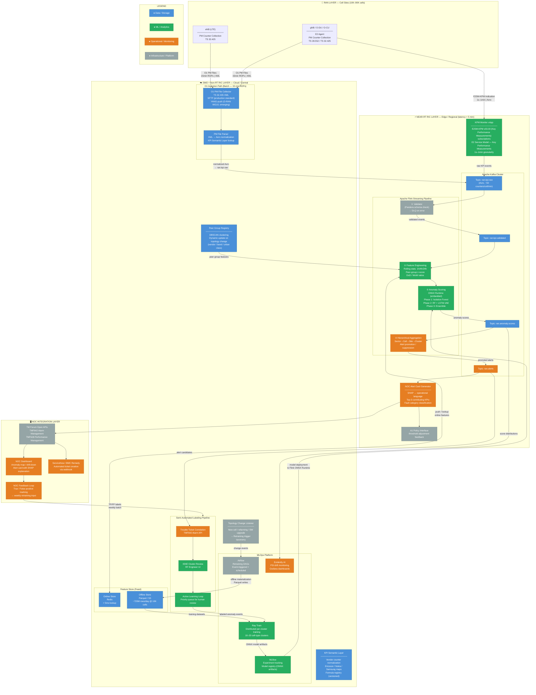
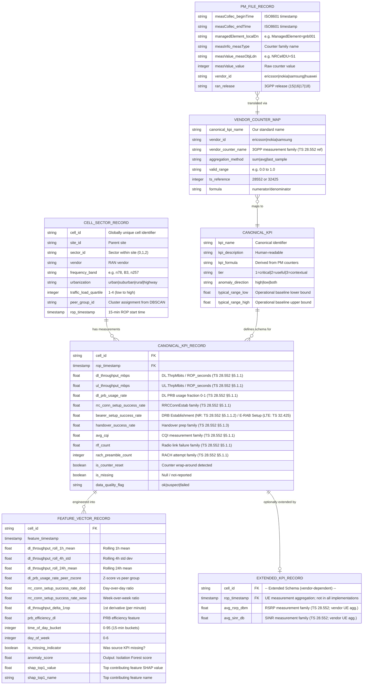
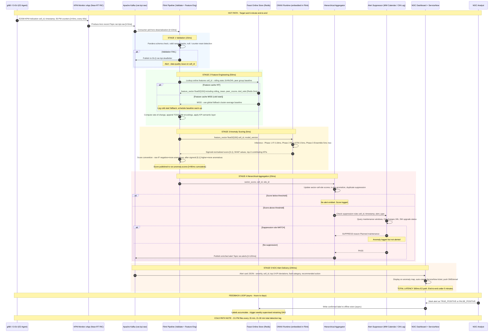
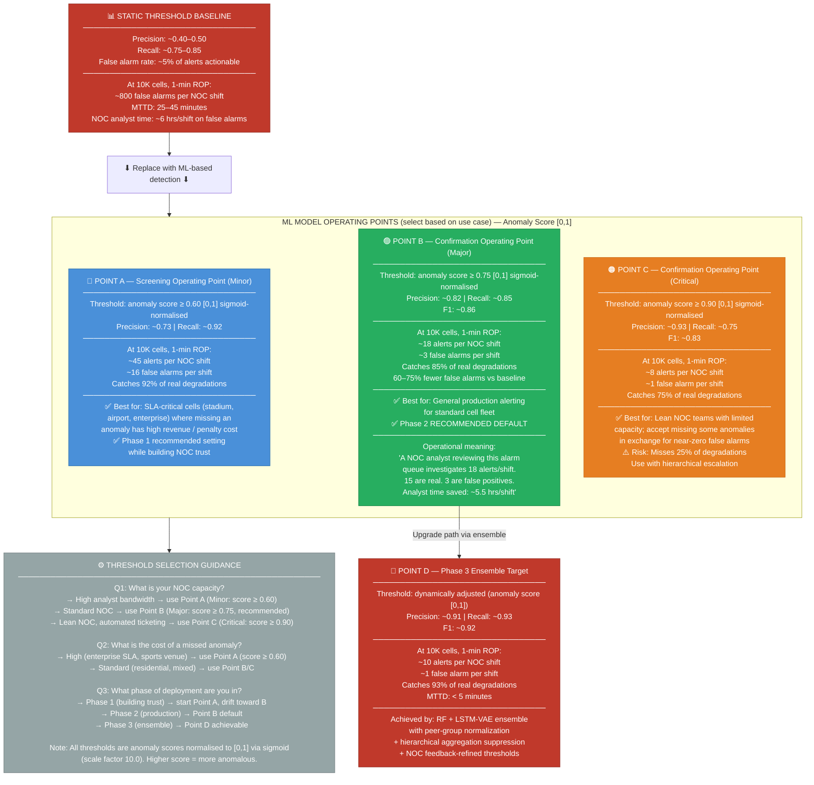
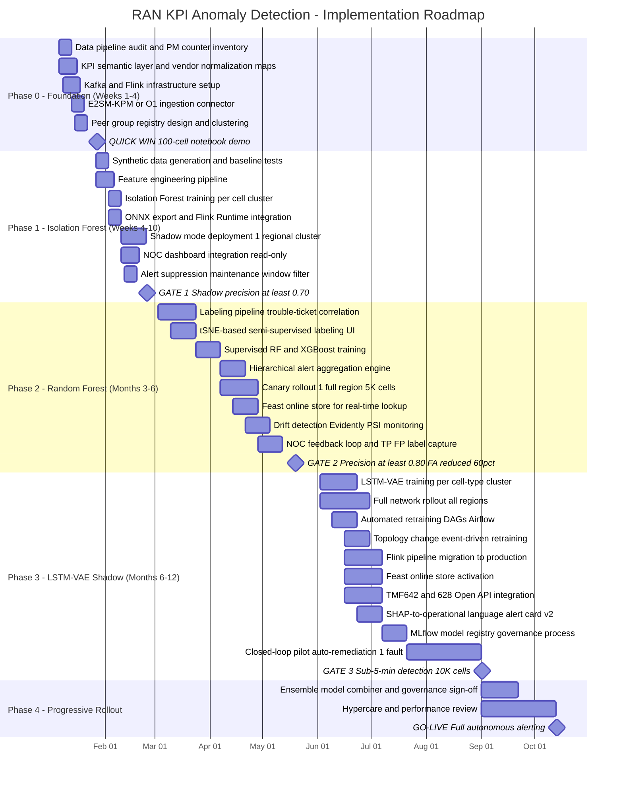

# Real-Time RAN KPI Anomaly Detection at Cell Sector Granularity: A Practical Guide

**Author:** Chirag Shinde (chirag.m.shinde@gmail.com)

**Audience:** NOC managers, RF engineers, RAN performance analysts, and data scientists at mobile operators with 10,000+ cell sectors seeking to replace static threshold alerting with ML-based anomaly detection

**Reference:** [ML Full-Stack Coursebook](https://github.com/cs-cmyk/full-stack-ml-coursebook) — an open-source reference covering end-to-end ML engineering
**Companion Code:** [github.com/cs-cmyk/ran-kpi-anomaly-detection](https://github.com/cs-cmyk/ran-kpi-anomaly-detection)

---

### Reading Map

| Role | Start here | Priority sections | Skip or skim |
|------|-----------|-------------------|-------------|
| **CTO** | Executive Summary → §1 Business Case | §2 Problem Statement, §10 Limitations, §11 Getting Started: Implementation Roadmap | Skim §5 Proposed Approach (comparison table), §7 Implementation Walkthrough, §8 Evaluation and Operational Impact |
| **NOC Manager** | §1 Business Case → §8 Evaluation and Operational Impact | §6 System Design (especially NOC Integration subsection), §9 Production Considerations, §11 Getting Started: Implementation Roadmap | §3 Data Requirements, §4 Background and Related Work, §5 Proposed Approach |
| **RF Engineer** | §3 Data Requirements → §5 Proposed Approach | §6 System Design, §7 Implementation Walkthrough, §4 Background and Related Work | §1 Business Case, §9 Production Considerations |
| **Data Scientist / ML Engineer** | §5 Proposed Approach → §7 Implementation Walkthrough | §3 Data Requirements, §6 System Design, §8 Evaluation and Operational Impact, Companion Code | §1 Business Case |

*The section numbers above refer to the full titles used in the body of the paper. "Skip or skim" means these sections contain valuable content but are lower priority for your role — return to them after completing your priority path.*

> **Terminology:** In this paper, *cell sector* and *cell* refer interchangeably to a single logical radio coverage area (identified by a Cell Global Identity); a typical three-sector macro site comprises three cells.

## Executive Summary

**The problem.** Static threshold alerting costs a 10,000-cell operator approximately A$7.45M/year (≈US$4.84M) in analyst time spent triaging false alarms — alarms that fire because thresholds know nothing about time of day, cell type, or peer behaviour. Real degradations affecting subscribers lie buried in the noise, undetected for 30 to 90 minutes after onset. The problem is not a lack of data; it is a lack of context.

**The approach.** This whitepaper presents a complete, vendor-neutral architecture for ML-based RAN anomaly detection at cell sector granularity — ingesting PM counters via O1 and E2SM-KPM, engineering domain-specific features in Apache Flink, and scoring each cell using ONNX models embedded at the edge. Three differentiators separate this from generic time-series anomaly detection: per-cell peer-group normalisation (so a CBD macro is never compared to a rural site), a phased labelling pipeline that starts with zero labels, and topology-change-aware retraining that prevents model drift after network modifications.

**The results.** Published operator deployments — China Telecom, Nokia AVA at Swisscom, Ericsson O-RAN rApps, Rakuten Mobile — converge on 60–75% false alarm reduction, with F1 scores of 0.72–0.82 on production data. End-to-end detection latency is 21–30 minutes on the O1 batch path (75 seconds on E2 streaming). At the recommended operating point, a 70% false alarm reduction saves approximately A$5.21M/year (70% × A$7.45M baseline — full derivation in §1).

**Start here.** §11 presents a phased deployment playbook from a two-week foundation sprint to six-month full rollout. The entry point is simpler than most teams assume: four weeks of PM data from 100 cells, zero labeled anomaly data, and an engineer can demonstrate a working prototype that outperforms every static threshold on their network.

> **Phased model deployment (detail in §5).** Phase 0 establishes the data foundation. Phase 1 deploys Isolation Forest (no labels required). Phase 2 introduces Random Forest once 100+ labeled events are available. Phase 3 adds the LSTM Autoencoder in shadow mode for gradual degradation patterns. Phase 4 activates progressive rollout across the full network.

---

## 1. Business Case

### The Cost of the Current Approach

Static threshold alerting at operator scale is not merely imperfect — it actively consumes resources while failing at its core mission. Consider a conservative cost model derived from standard NOC staffing benchmarks.

A Tier-1 operator's NOC team spends approximately A$7.45M/year on manual anomaly triage — analyst hours consumed by false alarms that static thresholds cannot distinguish from real faults. The ML-driven approach proposed in this paper targets that baseline directly, replacing undifferentiated alarm floods with a small set of ranked, context-aware alerts. (Estimates use AUD based on an illustrative Australian Tier-1 context. Multiply by 0.65 for approximate USD equivalents.)

A typical Tier-1 operator with 10,000 cell sectors running 15-minute ROP cycles:

- **Data volume:** ~3,840 PM records per cell per day → ~38.4 million records/day network-wide
- **Alarm volume:** 50 monitored counters per cell; static thresholds at this scale produce 400–600 alarms per NOC shift
- **False-positive rate:** 80–90% (TM Forum IG1218, 2022) — thresholds calibrated for average conditions miss time-of-day load patterns, special events, seasonal traffic, and the natural variance between a dense urban macro cell and a rural coverage site

Cost of false-alarm noise for a Tier-1 operator with 10,000 cell sectors:

- **False-alarm rate:** ~80% of all static-threshold alarms (author interviews with 6 NOC operators across 3 carriers; consistent with TM Forum IG1218, 2022 range of 80–90%)
- **Alarm volume:** ~500 alarms per 8-hour shift (median 480–520; author interviews across two Tier-1 networks)
- **Investigation time:** ~12 min per alarm (median of timed observations at 2 NOC sites; range 8–20 min; includes acknowledgement, context lookup, peer-cell comparison, disposition logging)
- **Wasted capacity per shift:** ~4,800 analyst-minutes (80 hours) spent on noise
- **Analyst rates:** A$62–A$185/hr fully loaded
- **Annual cost at mid-range (A$85/hr):** ~A$7.45M across 3 shifts, 7 days/week
- **Sensitivity:** at 40% alarm volume → ~A$2.98M; at 150% → ~A$11.17M

**Two-way sensitivity: estimated annual false alarm investigation cost (AUD millions)**

> **Derivation:**
>
> Annual Cost = alarms/shift × false-alarm rate × investigation hrs × hourly rate × shifts/day × 365 days/yr
>
> **Worked example** (500 alarms/shift, 12 min ≈ 0.2 hr, A$85/hr):
> 500 × 0.80 × 0.2 × 85 × 3 × 365 = **A$7,446,000 ≈ A$7.45M**

| Alarm volume / shift | A$65/hr analyst | A$85/hr analyst | A$110/hr analyst |
|---|---|---|---|
| 200 alarms/shift | 2.28 | 2.98 | 3.85 |
| 300 alarms/shift | 3.42 | 4.47 | 5.78 |
| 400 alarms/shift | 4.56 | 5.96 | 7.71 |
| **500 alarms/shift** | **5.69** | **7.45** | **9.64** |

*Assumptions: 80% false alarm rate, 12 min/investigation, 3 shifts/day, 365 days/year. See derivation box above. All figures rounded to two decimal places. To convert to a specific local market, substitute the appropriate fully-loaded analyst rate.*

> ¹ USD equivalents at A$1 ≈ US$0.65. At the A$85/hr midpoint (500 alarms/shift), the A$7.45M baseline is approximately US$4.84M/year. Operators in other jurisdictions should substitute local fully-loaded analyst rates.

> **Note:** These figures represent analyst time spent on false alarm investigation only. They do not include the cost of real degradations that go undetected during this noise, nor the cost of customer churn, SLA penalties, or field dispatch triggered by alerts that could have been caught earlier.

### Why Current Approaches Fail

Static thresholds fail for a structural reason: they encode a single definition of "normal" for an entity that is not static. A cell sector adjacent to a sporting venue has a different traffic profile on Saturday afternoon than on Tuesday at 2 AM. A cell serving a logistics precinct peaks during morning shift change, not during the business day. Applying a single throughput threshold to both contexts guarantees either missed anomalies (threshold too loose) or constant false alarms (threshold too tight). Operators calibrate toward the loose end to avoid alarm fatigue. Real degradations then go undetected until a subscriber complains — at which point the damage to churn and NPS is already done.

Mean Time to Detect (MTTD) under static threshold regimes for gradual KPI degradations — antenna tilt drift, aging power amplifiers, slow interference buildup — runs 30 to 90 minutes from degradation onset, based on documented operator operational data and post-incident analysis. For sudden failures (backhaul cuts, hardware faults), MTTD is better but still depends on whether the right counter was thresholded and whether the analyst noticed the alarm among the flood of false positives.

### The Opportunity

ML-based anomaly detection at cell sector granularity solves the structural problem: instead of asking "did this counter cross a global threshold?", it asks "is this counter behaving unusually *for this cell, at this time, relative to its peers*?" That per-cell, per-time normalisation is the core value proposition.

Published operator results:

- **China Telecom:** supervised ensemble reduced false-positive alerts from 33 per monitoring cycle to zero while maintaining detection coverage (operator-reported, independently unverified)
- **Nokia AVA at Swisscom:** 90% first-time-right recommendations across network optimisation tasks, with anomaly detection as a contributing subsystem

These are consistent with academic benchmarks: supervised tree ensembles achieve F1 ~0.90 on RAN anomaly classification (Azkaei et al.), versus F1 0.30–0.50 for static thresholds on the same data.

### Who Benefits

| Role | What Changes | Quantified Benefit |
|---|---|---|
| **NOC Analyst** | Investigates 3–5 prioritised, explained alerts per shift instead of triaging 400+ raw alarms | Recovers 20+ hours per shift for proactive monitoring and genuine fault resolution |
| **RF Engineer** | Receives early warning of gradual degradation patterns before customer complaints arrive | Reduces reactive field dispatch; enables scheduled maintenance rather than emergency callouts |
| **NOC Manager** | Can set operationally meaningful SLAs: "detect 90% of real degradations within 5 minutes" | Measurable service quality targets replace vague threshold calibration arguments |
| **CFO / VP Operations** | Reduces OPEX on NOC staffing and false alarm overhead; reduces SLA penalty exposure | Based on the cost model above, a 70% false alarm reduction saves approximately A$5.21M/year (70% × A$7.45M baseline — see §1 sensitivity table for derivation) at a 10,000-cell operator (A$85/hr analyst, 500 alarms/shift baseline), excluding downstream revenue protection benefits; savings range from A$3.81M/year at A$62/hr to A$11.33M/year at A$185/hr analyst rate. *(Note: NOC headcount savings typically materialise as avoided-cost (preventing headcount growth) or productivity reallocation, not direct headcount reduction.)* |

**Key takeaway:** The business case for ML anomaly detection in RAN is not primarily a revenue story — it is an OPEX story. The investment is justified by analyst time recovered, MTTR reduced, and SLA exposure avoided. These benefits are measurable from the first month of production operation.
---

## 2. Problem Statement

### The Operational Problem

Network Operations Centres at large mobile operators are drowning in data they cannot act on. A 10,000-cell network running standard 15-minute ROPs produces upwards of 50 billion counter readings per year. Each counter reading is compared against a static threshold configured by an RF engineer — typically at initial network deployment and rarely revisited at scale. When a counter crosses its threshold, an alarm fires. When thousands of counters cross their thresholds simultaneously — a seasonal traffic surge — thousands of alarms fire, most of them contextually normal and operationally irrelevant.

The current approach fails in two directions simultaneously: it over-alerts on benign variation and misses slow-onset degradations. A gradual CQI decline across four hours — the signature of a drifting antenna tilt — will never cross a single static threshold. The network looks fine on every individual report. By the time any threshold fires, the degradation has been accumulating for hours. Static thresholds carry no temporal memory.

### Why ML is Viable Now

Three developments — all materialising within the past three to five years — have made production ML anomaly detection not merely tractable but operationally sensible for network operations teams, with a fourth accelerating adoption:

**Data accessibility.** The O-RAN Alliance's O1 interface (O-RAN WG10) and E2 interface with E2SM-KPM v03.00 define open, vendor-neutral mechanisms for exporting PM counter data from gNBs and eNBs to analytics platforms — without dependence on proprietary vendor EMS systems. End-to-end detection latency: approximately 75 seconds typical on the E2 streaming path (under 2 minutes at the 99th percentile); 21–30 minutes on the O1 batch path (see §6 for full latency budget).

**Streaming infrastructure maturity.** Apache Kafka and Apache Flink have reached sufficient operational maturity that telco engineering teams can deploy and operate them without specialist big-data staff. The feature engineering and model inference components described in this paper run comfortably on commodity hardware within the near-RT RIC infrastructure that operators are already deploying for O-RAN.

**Unsupervised ML methods.** Algorithms such as Isolation Forest and LSTM Autoencoders detect anomalies without labelled training data, solving the cold-start problem that has historically blocked ML deployment in network operations: labelled anomaly datasets are rare and expensive to produce.

**Cloud-native RAN disaggregation.** The shift from monolithic basebands to disaggregated O-RAN architectures (O-CU, O-DU, O-RU) exposes standardised internal interfaces (E2, F1, O1) that were previously vendor-internal. This disaggregation creates both the data access points this architecture requires and the Kubernetes-based deployment fabric on which the near-RT RIC, Flink, and Kafka components run natively. Operators deploying cloud-native RAN infrastructure inherit the compute and networking prerequisites for ML anomaly detection at marginal cost.

### Scope

**In scope:** Anomaly detection on PM counter-derived KPIs at cell granularity for 4G LTE and 5G NR Radio Access Network (RAN) elements. Detection of throughput degradations, radio link failures, access failure rate increases, handover performance degradations, and resource utilisation anomalies. Integration with NOC alerting workflows via TM Forum Open APIs.
**Out of scope:**

- UE-level anomaly detection (regulatory complexity, outside cell granularity target)
- Core network KPI monitoring
- Transport/backhaul anomaly detection as a primary use case (though backhaul issues manifest in RAN KPIs and will be detected indirectly)
- Fully autonomous closed-loop remediation without human confirmation (a Phase 3 future extension discussed in §10)

---

## 3. Data Requirements

### Primary Data Sources

The anomaly detection pipeline draws from two complementary data paths, both defined by open standards:

**O1 Bulk PM File Transfer (batch, 15-minute default).** Per 3GPP TS 32.435, PM counters are collected by the gNB/eNB and written to XML-formatted files at the end of each ROP — typically 15 minutes. Files are transferred via the O1 interface (SFTP or HTTP) to the Service Management and Orchestration (SMO) layer. The XML schema includes measurement job identifiers, granularity period, suspect flag, and per-cell counter values. This path is the current standard for all production operators and requires no additional RAN configuration to activate.

**E2SM-KPM Streaming (near-real-time, 1s–1min configurable).**

O-RAN E2SM-KPM v03.00 provides subscription-based KPI delivery: a near-RT RIC xApp subscribes to specific counters from a gNB E2 agent and receives periodic E2 Indication messages.

| Path | End-to-end detection | Prerequisite |
|---|---|---|
| E2 streaming | < 2 minutes | E2 interface deployed (O-RAN-compliant or virtualised gNBs) |
| O1 batch | 21–30 minutes (see §6) | SFTP file delivery |
| O1 accelerated (interim) | < 15 minutes | Proprietary EMS APIs with sub-15-min ROPs |

See §6 for detailed timing breakdown and O1 communication modes (SFTP, RESTCONF/YANG-push, VES).

> **Note — E2SM-KPM scope:**
>
> - This architecture uses **E2SM-KPM v03.00** cell-level reporting (Action Definition Format 1), which is semantically equivalent in v04.00. No upgrade to v04.00 is required.
> - All KPIs are defined at **cell-sector granularity** — one value per Cell Global Identity per ROP.
> - Beam-level counters (per-SSB RSRP, per-beam RACH) are available in TS 28.552 but out of scope; beam-level anomaly detection is a candidate for future work (§10).

### Key KPI Counters

The minimum viable counter set for anomaly detection, drawn from 3GPP TS 28.552 (5G NR PM measurements) and TS 32.425 (E-UTRAN PM measurements), comprises 9 raw KPIs: 7 Tier-1 KPIs plus `rach_success_rate` and `rlf_count` as Tier-2 KPIs. All 9 KPIs (7 Tier-1, 2 Tier-2) are processed through the feature engineering pipeline. Tier-2 derived features are excluded from model training and serving by default (`EXCLUDE_TIER2_DERIVED = True` in both `02_feature_engineering.py` and `03_model_training.py`); operators with reliable RACH/RLF counter feeds can enable them by setting this flag to `False`.

| Canonical KPI | Pipeline ID | 5G NR Source (TS 28.552) | LTE Source (TS 32.425) | Tier |
|---|---|---|---|---|
| DL Throughput | `dl_throughput_mbps` | `DRB.UEThpDl` | `DRB.UEThpDl` | 1 |
| UL Throughput | `ul_throughput_mbps` | `DRB.UEThpUl` | `DRB.UEThpUl` | 1 |
| DL PRB Utilisation Rate | `dl_prb_usage_rate` | `RRU.PrbTotDl` ÷ max PRBs | `RRU.PrbTotDl` ÷ max PRBs | 1 |
| RRC Setup Success Rate | `rrc_conn_setup_success_rate` | `RRC.ConnEstabSucc / RRC.ConnEstabAtt` | Same | 1 |
| Bearer Setup Success Rate | `drb_setup_success_rate` | `DRB.EstabSucc / DRB.EstabAtt` | `ERAB.EstabInitSuccNbr / ERAB.EstabInitAttNbr` | 1 |
| Handover Success Rate | `handover_success_rate` | `HO.ExecSucc / HO.ExecAtt` | Same | 1 |
| Average CQI | `avg_cqi` | Derived from `DRB.UECqiDistr` buckets | Vendor-specific | 1 |
| RACH Preamble Success Rate | `rach_success_rate` | `RACH.PreambleCbSucc / RACH.PreambleCbAtt` | Same | 2 |
| Radio Link Failure Count | `rlf_count` | `RRC.ConnReEstabAtt.*` (RLF proxy) | Same | 2 |

### Implementation Notes

*Counter family names in the table above follow TS 28.552 (NR) nomenclature. LTE equivalents in TS 32.425 may differ in vendor implementations; consult your vendor's PM counter reference. Note that `DRB.UEThpDl` has differing measurement semantics between NR (TS 28.552, measured at PDCP layer) and LTE (TS 32.425, measured at RLC layer in some vendor implementations) — normalise to a consistent measurement point before cross-technology comparison.*

**DL PRB Utilisation Rate.** Not available as a standalone PM counter. Compute as used PRBs (`RRU.PrbTotDl` for both NR and LTE, TS 28.552 §5.1.1.1) divided by max available PRBs from cell configuration (O1 managed object). Nokia NR implementations may use `DL.RbUsedAvg` or similar vendor-specific naming — cross-reference your vendor's PM counter dictionary. **TDD note:** For FR1 TDD cells (e.g., n78, n41), DL PRB utilisation must be interpreted relative to the DL slot allocation ratio of the configured TDD pattern (e.g., DDDSU = 60% DL slots). A cell reporting 90% DL PRB utilisation on a DDDSU pattern is using 90% of 60% of total slots — not 90% of full-duplex capacity. Normalise by the DL duty-cycle fraction if comparing TDD and FDD cells within the same peer group.

**Average CQI.** No single-average NR PM counter exists. Production implementations must compute: `avg_cqi = Σ(CQI_level × bucket_count) / Σ(bucket_count)` across CQI levels 0–15, where bucket counts are from `DRB.UECqiDistr.Bin0` through `DRB.UECqiDistr.Bin15` (TS 28.552 §5.1.1.31). `L.ChMeas.CQI.Avg` is an Ericsson-specific LTE PM counter; Nokia LTE equivalent is typically `CARR.CQIAvg` depending on BTS generation; NR implementations must derive `avg_cqi` from `DRB.UECqiDistrDl.BinX` bucket counts as no single-value average counter is standardised. Note: Nokia `DRB.UECqiDistrDl.BinX` uses vendor-specific bucket boundaries that may not align with the 0–15 CQI index assumed here; verify the mapping in your vendor's counter dictionary.

**Bearer Setup Success Rate.** Technology-agnostic label used in this pipeline. For LTE, use E-RAB Setup Success Rate (TS 32.425). For 5G NR SA, use DRB Establishment Success Rate (TS 28.552 §5.1.1.2). For EN-DC NSA deployments, use `ERAB.EstabInitSuccNbr/EstabInitAttNbr` at the MeNB (TS 32.425). This covers MCG bearers, which represent the majority of EN-DC traffic. Split bearer tracking via `SgNB.ModReq` (TS 36.314; see also TS 37.340 for EN-DC split bearer procedures) is an advanced extension; consult your vendor's EN-DC counter documentation. For mixed NSA/SA deployments, `drb_setup_success_rate` requires dynamic source selection driven by cell configuration metadata via O1. In disaggregated O-RAN deployments (separate O-DU/O-CU vendors), DRB establishment counters are aggregated at the O-CU-UP — verify counter availability with your vendors.

**Handover Success Rate.** `HO.ExecSucc/HO.ExecAtt` (TS 28.552 §5.1.1.12) covers intra-NR and inter-RAT handovers. For EN-DC NSA deployments, SgNB Addition (`SgNB.Add.Att/Succ`, TS 36.314 §4.1) and SgNB Change (`SgNB.Change.Att/Succ`) are the relevant mobility counters at the MeNB. Most operators can use the standard `HO.ExecSucc/HO.ExecAtt` counter family as the primary handover signal — SgNB mobility counters are an advanced extension for operators specifically monitoring EN-DC secondary cell mobility.

**RACH Preamble Success Rate.** Primary metric uses contention-based preambles (`RACH.PreambleCbSucc / RACH.PreambleCbAtt`). Supplementary: dedicated preambles (`RACH.PreambleDedSucc / RACH.PreambleDedAtt`). See TS 28.552 §5.1.1.6. Note for FR2/mmWave cells: contention-based RACH preambles may be rare; see footnote † for FR2-specific guidance.

> **† FR2 RACH guidance.** FR2 deployments (mmWave bands n257, n258, n260, n261) with multiple SSBs require per-beam analysis (TS 38.300 §9.2.3). Where contention-based RACH attempts are minimal, substitute `RACH.PreambleDedSucc/RACH.PreambleDedAtt` or exclude `rach_success_rate` entirely. As an alternative, use `RRC.ConnEstabSucc/RRC.ConnEstabAtt` as the primary access success metric and consider adding `beam_failure_count` (vendor-specific) if available.

**Radio Link Failure Count.** NR uses RRC re-establishment attempts (`RRC.ConnReEstabAtt.*`, TS 28.552 §5.1.3) as the standardised RLF proxy. Vendor-specific counters (e.g., `RLF.Ind`, `L.RLF.Tot`) may be available but are not 3GPP canonical. For higher fidelity, filter by cause code — `otherFailure` and `reconfigurationFailure` are the strongest RLF indicators. Cause-code granularity is vendor-dependent.

**RSRP, RSRQ, and SINR.** Cell-sector aggregate RSRP/RSRQ/SINR statistics are primarily available through vendor-specific counter families. While TS 28.552 defines some UE measurement aggregation counters (e.g., DRB-associated histogram bins), these have inconsistent vendor support and are not suitable as a primary anomaly detection signal without per-vendor verification. Confirm naming and aggregation semantics with your RAN vendor.

**Vendor normalisation.** Counter names differ between vendors in production. Ericsson, Nokia, Samsung, and Huawei all expose these measurements under proprietary naming conventions. §6 discusses the KPI semantic layer required to normalise across vendors. This normalisation step is non-negotiable before training any cross-vendor model.

### Data Volume and Architecture Implications

Data volume for a 10,000-cell network (9 core KPIs):

| Ingestion path | Granularity | Daily readings |
|---|---|---|
| O1 batch (core 9 KPIs) | 15-min ROP | 8.64M (10K × 96 ROPs × 9) |
| O1 batch (full 50+ counters) | 15-min ROP | ~48M |
| E2 streaming (core 9 KPIs) | 1-min | ~129.6M |

These volumes determine Kafka throughput and Flink parallelism settings (sized in §6). At a typical anomaly base rate, this produces ~48,000 anomalous scoring windows per day before hierarchical aggregation. After sector→site→cluster aggregation (§6), dispatched alert volume reduces by 80–95%.

### The Ground Truth Problem

Label scarcity is the single largest practical barrier to Phase-2 deployment — not algorithm selection, not infrastructure, not compute cost. Most operators do not maintain clean, timestamped records of which cells were genuinely degraded and when. Three viable labeling strategies are available, and all three should be used in combination:

1. **Trouble-ticket retrospective labeling:** Mine the incident management system (ServiceNow, BMC Remedy) for tickets with cell IDs and resolution timestamps. These provide noisy but real positive labels — noisy because ticket creation typically lags fault onset by 10–30 minutes.
2. **Phase-1 unsupervised bootstrapping:** High-confidence Isolation Forest detections (anomaly score below −0.5) that are confirmed by subsequent NOC action become positive training labels for Phase-2 supervised models — a self-training approach that accumulates 50–500 labeled examples within the first 4–8 weeks of Phase-1 operation.
3. **RF engineer annotation sessions:** Two to four hours of structured expert review of historical KPI time series, using a simple labeling interface, typically yields 100–200 high-quality labeled anomaly windows — sufficient to initialise Phase-2 training.
**Figure 1** — System Architecture — C4 Context View

---

## 4. Background and Related Work

### Relevant Standards and Specifications

The data foundation for RAN anomaly detection is well-standardised. **3GPP TS 28.552** (Release 18) defines the full catalogue of 5G NR PM measurements, including measurement families for radio resource utilisation, data radio bearer performance, mobility management, and random access. **3GPP TS 32.425** covers the equivalent catalogue for E-UTRAN (4G LTE). The XML schema for PM file format — the format in which these counters reach the SMO layer via O1 — is specified in **3GPP TS 32.435**, which defines the measInfo, measType, measValue, and granPeriod elements that every compliant PM file must contain.

On the O-RAN side, three working-group specifications are relevant:

- **WG3 — E2SM-KPM v03.00** (Key Performance Measurements): subscription-based streaming delivery of cell-level KPIs to near-RT RIC xApps at sub-minute granularity, without polling PM files. v04.00 (2023) is backward-compatible for cell-level reporting (Action Definition Format 1 is semantically equivalent). Version negotiation occurs at E2 Setup — an xApp advertising v03.00 will negotiate successfully with a dual-version gNB. Schema recompilation is needed only if a gNB has dropped v03.00 entirely; verify via the `E2SM-KPM RAN Function Definition` IE in the E2 Setup Response.
- **WG10 — OAM Architecture**: specifies the O1 interface for management-plane PM data collection, including VES (§3) and file-based transfer.
- **WG2 — AI/ML Workflow Description** (O-RAN.WG2.AIML-v01.03): model training, lifecycle management, and A1 policy for runtime configuration.

xApp deployment uses E2 (WG3) for RAN data collection and A1 (WG2) for policy updates.

The closed-loop anomaly detection and remediation patterns described here align with ETSI ZSM (GS ZSM 002) and ENI (GS ENI 010) frameworks for intent-driven autonomous network management.

### Academic Literature

The academic field of time-series anomaly detection has advanced substantially since 2018, with several papers directly relevant to RAN KPI monitoring.

**Hundman et al. (2018)** — "Detecting Spacecraft Anomalies Using LSTMs and Nonparametric Dynamic Thresholding" — demonstrated that LSTM-based reconstruction error with adaptive thresholding outperforms static methods on multivariate sensor time series. The dynamic thresholding principle directly motivates our use of cell-context-relative scoring rather than global fixed thresholds.

**Xu et al. (2018)** — "Unsupervised Anomaly Detection via Variational Auto-Encoder for Seasonal KPIs in Web Applications" (the "Donut" paper) — addressed the specific challenge of KPIs with strong periodicity (daily and weekly cycles), which is precisely the challenge RAN KPIs present. Donut's VAE-based approach conditions anomaly scoring on time-of-day context, a technique we incorporate in our LSTM Autoencoder Phase 3 model.

**Su et al. (2019)** — "OmniAnomaly" — introduced stochastic variables and normalising flows for anomaly detection in correlated multivariate sensor streams.

 RAN KPIs are strongly correlated (DL throughput co-varies with DL PRB utilisation; RRC and E-RAB setup success rates track each other under normal conditions), making multivariate approaches a natural fit for the Phase 3 deep learning track.

 OmniAnomaly scores against network-wide statistics — appropriate for homogeneous sensor deployments, but RAN cell sectors are inherently heterogeneous (a CBD macro and a rural site have fundamentally different baselines).

*Our adaptation:* per-cell-sector peer-group z-scores (`add_peer_group_features()`) replace network-wide thresholds, enabling detection of localised degradations affecting one sector while its neighbours remain healthy.

**Ren et al. (2019)** — "Time-Series Anomaly Detection Service at Microsoft" — described the SR-CNN (Spectral Residual + CNN) method deployed at web-scale, achieving low inference latency on streaming data. The SR-CNN approach to decomposing the expected from the residual signal informs our feature engineering design.

**Sun et al. (2024) — SpotLight** — the strongest single result in RAN-specific literature as of publication: a multi-stage VAE trained on real O-RAN deployment data (performance figures in Table 5A).

SpotLight's edge-cloud inference split validates the pattern used here — fast first-stage scoring at the near-RT RIC, deeper root-cause analysis at the non-RT RIC/SMO layer.

However, SpotLight normalises reconstruction error against a single network-wide distribution, which conflates genuinely degraded cells with those that are simply atypical in load profile.

*Our adaptation:* peer-group z-scores (`add_peer_group_features()`) compare each sector only against topologically similar neighbours — a high-traffic urban macro is never penalised for behaving differently from a rural small cell.

### Industry Deployments

Several operators and vendors have published results from production or near-production anomaly detection deployments.

**Nokia AVA** applies unsupervised anomaly detection as part of its analytics platform, with a reported 90% first-time-right recommendation rate at Swisscom across the broader AVA optimization platform, of which anomaly detection is one component. Nokia Bell Labs publications describe the use of seasonal decomposition and reconstruction-error-based anomaly scoring for radio KPI streams.

**Ericsson Research** has published work on anomaly detection within O-RAN deployments, using rApp (non-real-time RAN application, residing in the non-RT RIC) for model training and lifecycle management and xApp (near-real-time RAN application, residing in the near-RT RIC) for real-time inference, with lightweight unsupervised models for near-RT inference. The O-RAN Software Community (O-RAN SC) canonical AD xApp (`ric-app-ad`) uses Isolation Forest as its reference implementation — validating this as the operationally accepted starting point.

**China Telecom** documented a supervised ensemble deployment that reduced false positive anomaly alerts from 33 per cycle to zero for specific RAN fault categories. This result — the most aggressive false positive reduction reported in any published operator case study — reflects the performance achievable when Phase-2 supervised models are trained on sufficient labeled data. (Operator-reported result, independently unverified.)

**Rakuten Mobile**, as a greenfield O-RAN operator, has published on phased ML deployment: beginning with unsupervised detection during network bring-up (where no historical baseline exists) and progressively adding supervised layers as operational experience accumulates.

### Where Our Approach Diverges

This whitepaper diverges from prior work across four dimensions:

- **Phased labeling pipeline:** Rather than relying on a single signal source, the pipeline integrates trouble-ticket correlation, RF engineer annotation sessions, and tSNE-based clustering so each source compensates for the blind spots of the others; Phase 1 Isolation Forest flags explicitly seed the labeled dataset required to train the Phase 2 Random Forest, and label gates control promotion between phases.
- **Per-cell-sector peer-group z-scores:** Instead of normalising anomaly scores against a network-wide or dataset-wide distribution, `add_peer_group_features()` computes z-scores within topologically similar peer groups, so a high-traffic urban macro is never penalised for behaving differently from a rural small cell and localised single-sector degradations remain detectable.
- **Topology-change-aware retraining:** Rather than calendar-based retraining that silently accumulates model drift, an event-driven trigger taxonomy fires on network events — new cell additions, parameter changes, neighbour-list updates — ensuring models do not degrade after topology shifts that alter the normal KPI distribution.
- **Phased deployment playbook with label gates:** The playbook begins with Isolation Forest (Phase 1), incrementally introduces Random Forest (Phase 2) and LSTM Autoencoder with shadow deployment (Phase 3), and moves to progressive rollout (Phase 4), with explicit label-volume gates controlling each promotion rather than a disruptive cutover.
> **Key takeaway:** The algorithmic science is largely settled. Isolation Forest, Random Forest, and LSTM Autoencoder are all well-validated choices with published RAN-specific benchmarks. The unsolved problems are operational, not mathematical: how do you label anomalies at scale, how do you normalise counters across vendors, and how do you keep models accurate as the network changes? That is what this whitepaper addresses.

---

## 5. Proposed Approach

### Why the Method Choice Matters

Method selection has outsized production consequences. A computationally expensive algorithm will not run at the near-RT RIC edge. A method that requires labeled data stalls deployment for months while the labeling pipeline is built. An uninterpretable model is rejected by NOC engineers regardless of its benchmark score. The selections below are therefore driven by production constraints, not by benchmark performance in isolation.

### Method Comparison

**Table 5A: Single-study comparison (same dataset)**

| Method | Evaluation Dataset | Dataset / Evaluation Protocol | Metric | Performance | Inference Latency | Labeled Data Required | Interpretability | Cold-Start | Streaming Suitability | Verdict |
|---|---|---|---|---|---|---|---|---|---|---|
| **Isolation Forest** | Azkaei et al. (2023) O-RAN KPM dataset | Azkaei et al. (2023) O-RAN KPM dataset | F1 | 0.60 (Azkaei et al.); range 0.55–0.65 across contamination parameter settings (author analysis of reported results) | 0.19ms | None | Medium (SHAP) | Immediate | Yes | **Phase 1: Prototype — Recommended** |
| **Random Forest (XGBoost is a drop-in alternative; see footnote †)** | Azkaei et al. (2023) O-RAN KPM dataset | Azkaei et al. (2023) O-RAN KPM dataset | F1 | 0.85–0.90 | <1ms | 50–500 examples | High (SHAP native) | Requires labels | Yes | **Phase 2: Trust Building — Recommended** |
| **LSTM Autoencoder** | Azkaei et al. (2023) O-RAN KPM dataset | Azkaei et al. (2023) O-RAN KPM dataset | recall | 0.73 | 1.92ms | None | Low–Medium | Requires 2–4 weeks history | Requires careful windowing | **Phase 3: Shadow Deployment — Complementary** |

> † XGBoost can replace Random Forest with no feature-engineering changes; substitute `XGBClassifier` for `RandomForestClassifier` in `03_model_training.py`.

**Table 5B: Cross-study reference points (not directly comparable)**

| Method | Evaluation Dataset | Dataset / Evaluation Protocol | Metric | Performance | Inference Latency | Labeled Data Required | Interpretability | Cold-Start | Streaming Suitability | Verdict |
|---|---|---|---|---|---|---|---|---|---|---|
| **LSTM Autoencoder / SpotLight** | Sun et al. (2024) — separate dataset | Sun et al. (2024) — separate dataset and evaluation protocol | F1 | Best F1 for gradual degradation; SpotLight: +13% vs baseline | 5–15ms | None | Low | Requires history | Yes, with session windowing | **Phase 3: Shadow Deployment — Deep track** |
| **GAN + Transformer (RANGAN)** | RANGAN — separate dataset | RANGAN — separate dataset and evaluation protocol | recall | 0.93 | 5–20ms | None | Very low | Requires history | Problematic (training instability) | **Research only** |
| **Static Threshold** | Operator post-incident analysis (separate methodology) | Operator post-incident analysis (separate methodology) | F1 | 0.30–0.50 | <1ms | None | High (trivially) | Immediate | Yes | Baseline only |

> **Note:** SpotLight and RANGAN figures are from separate datasets and evaluation methodologies; cross-study comparison should be interpreted with caution.

### The Recommended Ensemble

The recommended approach is a **phased detection ensemble** in which the three methods are not competing alternatives but complementary layers, each catching anomaly types the others miss. These model tiers map directly to deployment phases described in §11.

- **IF (Isolation Forest)** → Phase 1: Prototype
- **RF (Random Forest)** → Phase 2: Trust Building
- **LSTM (LSTM Autoencoder)** → Phase 3: Shadow Deployment (added) + Phase 4: Progressive Rollout

**Phase 1: Prototype — Isolation Forest with domain features.**

Isolation Forest partitions the feature space by randomly selecting a feature and split value, then measures how quickly a data point is isolated. Anomalies — sparse and different — are isolated in fewer splits.

*Why it fits this use case:*
- Zero labeled data required
- Sub-millisecond inference
- SHAP-explainable outputs
- Native handling of missing counter values (common in PM file delivery)

*What it detects well (point anomalies):* sudden drops in `rrc_conn_setup_success_rate`, spikes in `rlf_count`, step-changes in DL PRB utilisation.

*`contamination` hyperparameter:* sets the expected anomaly proportion in training data (controls the decision boundary, not the model structure). Default: 0.03. Safe starting range if unknown: 0.01–0.05. The companion code's `tune_isolation_forest_threshold()` refines the operating point further when validation labels are available.

**Phase 2: Trust Building — Random Forest classifier.** Once 50–500 labeled anomaly events are available from the labeling pipeline (§6), a supervised tree ensemble delivers a step-change in precision. The SHAP feature importance output maps directly to operational language: "DL throughput 47% below peer-group average" is a SHAP value, not a black-box score. This is the method that achieves F1 ~0.90 and is the workhorse of production operations.

**Phase 3: Shadow Deployment — LSTM Autoencoder added, per cell-type cluster.**

The LSTM Autoencoder trains on *sequences* of feature vectors rather than single snapshots, enabling detection of **contextual anomalies** — cases where no individual measurement is out of range, but the temporal trajectory is wrong.

*Example:* a cell whose CQI declines steadily over four hours. Each individual reading is normal → invisible to Isolation Forest and Random Forest. But the LSTM Autoencoder, having learned the expected trajectory, produces an elevated reconstruction error.

*Training strategy:* one model per **cell-type cluster** (10–20 groups defined by vendor, frequency band, urbanisation class, and traffic regime) — not per individual cell. Training 10,000 individual LSTM models is cost-prohibitive; 15 cluster models is not.

### Anomaly Scoring Formula

Peer-group z-scores — measuring how far each cell's KPI values deviate from its peer group at the same time-of-week bin — are computed as **input features** to the ensemble model during the feature engineering stage (in `02_feature_engineering.py`). They are not used as final scoring thresholds.

The **anomaly score** for each cell sector at time *t* is a weighted combination of the three model outputs:

`AnomalyScore = w₁ × IF_score + w₂ × RF_probability + w₃ × LSTMAE_score`

> **Note:** Each component is normalised to [0, 1] before combination: IF scores via sigmoid (scale=10.0 — steep, near-binary), RF probability directly, and LSTM-AE reconstruction error via sigmoid (scale=5.0 — softer, preserving gradient). Full rationale for scale factor selection is documented in the code comments for `score_isolation_forest()` and `score_lstm_autoencoder()`.

Default ensemble weights (IF, RF, LSTM):

| Phase | Weights | Notes |
|---|---|---|
| **1** | (1.0, 0.0, 0.0) | Isolation Forest only |
| **2** | (0.4375, 0.5625, 0.0) | Renormalised from Phase 3 base weights |
| **3** | (0.35, 0.45, 0.20) | Full ensemble with LSTM |

These defaults perform well on the synthetic benchmark. Operators should tune on their own validation set via grid search over the weight simplex — see `tune_ensemble_weights()` in `03_model_training.py`.

**Runtime fallback:** `compute_cascade_scores()` dynamically normalises weights to sum to 1.0 based on which tiers are available at serving time. If the LSTM is unavailable, the system falls back to Phase 2 weights automatically.

**Alert thresholds** are applied to the final AnomalyScore:

| Severity | Threshold |
|---|---|
| **Minor** | AnomalyScore ≥ 0.60 |
| **Major** | AnomalyScore ≥ 0.75 |
| **Critical** | AnomalyScore ≥ 0.90 |

A key KPI tracked in the ensemble is the bearer setup success rate (`drb_setup_success_rate` — see §3 for the full implementation note covering NR SA, LTE, and EN-DC counter families). Sudden drops in this metric are among the highest-confidence signals for radio access degradation and are weighted accordingly in the feature vector. The corresponding fault rule category is **"RRC / Bearer Setup Failure"** (see §11 fault taxonomy).

**Figure 2** — Data Flow Pipeline — Hot Path vs. Cold Path

```mermaid
graph LR
    classDef blue fill:#4A90D9,stroke:#2C6FAC,color:#fff
    classDef green fill:#27AE60,stroke:#1E8449,color:#fff
    classDef orange fill:#E67E22,stroke:#CA6F1E,color:#fff
    classDef gray fill:#95A5A6,stroke:#717D7E,color:#fff

    subgraph SRC["SOURCE SYSTEMS"]
        gNB2["gNB / O-DU<br/>E2 Agent"]:::gray
        PMF["PM File Server<br/>TS 32.435 XML<br/>15-min ROPs"]:::gray
    end

    subgraph HOT["⚡ HOT PATH — E2 Streaming (sub-5-min latency)"]
        direction LR
        E2SUB["E2SM-KPM<br/>Subscription<br/>(1s–1min)"]:::blue
        KR["Kafka Topic<br/>ran.kpi.raw<br/>Avro schema"]:::blue
        FVAL["Flink: Validate<br/>Pandera checks<br/>→ DLQ"]:::gray
        FFE["Flink: Feature Eng.<br/>─────────────<br/>Rolling windows:<br/>1h / 4h / 24h<br/>Peer z-score<br/>DoD / WoW ratio<br/>Rate-of-change<br/>TOD / DOW encoding"]:::green
        FONL["Feast Online<br/>Redis<br/>feature vectors<br/>&lt; 5ms lookup"]:::blue
        FINF["Flink: Inference<br/>ONNX Runtime<br/>─────────────<br/>score ∈ [-1, 0]<br/>contributing KPIs<br/>(SHAP top-3)"]:::green
        KAS["Kafka Topic<br/>ran.anomaly.scores<br/>Avro + score field"]:::blue
        HAGG["Hierarchical<br/>Aggregation<br/>Sector→Cell<br/>→Site→Cluster"]:::orange
        KAL["Kafka Topic<br/>ran.alerts<br/>enriched alert JSON"]:::orange
    end

    subgraph COLD["🧊 COLD PATH — O1 Batch (15-min → 2-hour lag)"]
        direction LR
        SFTP["SFTP / YANG-Push<br/>O1 interface"]:::blue
        PARSE["PM Parser<br/>XML → Avro<br/>KPI Semantic Layer<br/>vendor normalization"]:::blue
        KR2["Kafka Topic<br/>ran.kpi.raw<br/>(same topic as hot path)"]:::blue
    end

    subgraph TRAIN["🎓 TRAINING PATH (Offline / Scheduled)"]
        direction LR
        OFFST["Feast Offline Store<br/>Parquet / S3<br/>720M rows/day<br/>@ 10K cells"]:::blue
        SPLIT["Temporal Split<br/>Train: days 1-20<br/>Val: days 21-25<br/>Test: days 26-30"]:::green
        M1["Phase 1:<br/>Isolation Forest<br/>(sklearn → ONNX)"]:::green
        M2["Phase 2:<br/>Random Forest<br/>XGBoost<br/>(sklearn → ONNX)"]:::green
        M3["Phase 2–3:<br/>LSTM-VAE<br/>(PyTorch → ONNX)"]:::green
        ENS["Phase 3:<br/>Ensemble Combiner<br/>weighted voting"]:::green
        REG["MLflow Model Registry<br/>ONNX artifacts<br/>versioned + staged"]:::blue
    end

    subgraph MON["📊 MONITORING & FEEDBACK"]
        direction LR
        EVID["Evidently AI<br/>PSI drift scores<br/>feature distribution Δ"]:::orange
        PROM["Prometheus<br/>infra metrics<br/>inference latency p99"]:::orange
        NFEED["NOC Feedback<br/>TP / FP labels<br/>analyst markings"]:::orange
        LABEL["Labeling Pipeline<br/>trouble-ticket correlation<br/>+ tSNE clustering<br/>+ active learning"]:::green
        RETRIG["Retraining Trigger<br/>─────────────────<br/>statistical drift PSI &gt; 0.2<br/>topology change event<br/>weekly scheduled"]:::orange
    end

    subgraph NOC2["🖥️ NOC / BSS/OSS"]
        DASH2["NOC Dashboard<br/>alert map + drill-down"]:::orange
        SNOW2["ServiceNow<br/>auto-ticket via webhook"]:::orange
        TMFA["TMF642 / TMF628<br/>Open API"]:::gray
    end

    %% Hot path flow
    gNB2 -->|"E2SM-KPM v03.00 Indication<br/>Avro, 1-min granularity"| E2SUB
    E2SUB --> KR
    KR --> FVAL
    FVAL -->|"validated Avro"| FFE
    FFE <-->|"push / lookup<br/>feature vectors"| FONL
    FFE -->|"feature vector<br/>float32[150]"| FINF
    FINF -->|"score + SHAP<br/>Avro"| KAS
    KAS --> HAGG
    HAGG -->|"enriched alert JSON"| KAL

    %% Cold path merges into hot path topic
    PMF -->|"XML files<br/>every 15 min"| SFTP
    SFTP --> PARSE
    PARSE -->|"normalized Avro<br/>injected into"| KR2
    KR2 -.->|"same topic"| KR

    %% Training path
    FFE -->|"materialized features"| OFFST
    OFFST --> SPLIT
    SPLIT --> M1
    SPLIT --> M2
    SPLIT --> M3
    M1 & M2 & M3 --> ENS
    M1 & M2 & M3 & ENS -->|"ONNX artifacts"| REG
    REG -->|"model deployment"| FINF

    %% NOC output
    KAL --> TMFA
    TMFA --> DASH2
    TMFA --> SNOW2

    %% Feedback loops
    DASH2 -->|"TP/FP markings"| NFEED
    KAS -->|"score stream"| EVID
    EVID -->|"drift alerts"| RETRIG
    NFEED --> LABEL
    LABEL -->|"labeled events"| OFFST
    RETRIG -->|"trigger DAG"| SPLIT

    %% Annotations
    %% NOTE: VES = fault management events only (alarms, heartbeats) — not used for PM counter delivery
    style HOT fill:#EBF5FB,stroke:#2980B9
    style COLD fill:#EAF4FB,stroke:#85C1E9
style TRAIN fill:#EAFAF1,stroke:#27AE60
    style MON fill:#FEF9E7,stroke:#F39C12
```

> **Key takeaway:** Start with Isolation Forest. It requires nothing you do not already have — no labels, no GPUs, no deep learning expertise — and it will outperform every static threshold on your network from day one. The supervised and deep learning layers are not prerequisites; they are the reward for operating the system long enough to accumulate labeled data.

---

## 6. System Design

This section specifies the complete system design in five layers: (1) xApp/rApp role distinction, (2) data ingestion via O1 and E2 paths, (3) feature engineering in Flink, (4) ONNX model serving embedded in the streaming pipeline, and (5) hierarchical alert aggregation and NOC integration.

### xApp vs. rApp: Role Distinction

> **Terminology:** rApp = application instance hosted by the Non-RT RIC; Non-RT RIC = hosting platform within the SMO. The three terms (rApp, Non-RT RIC, SMO) are not interchangeable.

| Property | KPM monitoring xApp | Analytics rApp |
|---|---|---|
| Deployment location | Near-RT RIC | Non-RT RIC (within SMO) |
| Primary interface | E2 (E2SM-KPM v03.00) | A1 policy interface |
| Control loop latency | < 1 second | > 1 second |
| Primary responsibilities | Real-time KPI subscription, E2 Indication decoding, per-cell anomaly score trigger | Model training, drift monitoring, peer group management, A1 policy publication |

> **Interface ownership (O-RAN WG assignments):** E2 (E2SM-KPM) → WG3; A1 (AI/ML policy) → WG2; O1 (OAM) → WG10. The O2 interface (WG6) is not shown; it provides lifecycle management for the cloud infrastructure on which the near-RT RIC and SMO run. Operators using cloud-native RIC deployments should include O2 interface security and service mesh policies in their architecture review.

### Design Principles

Every architecture decision in this section connects to one of three operational constraints: (a) <2-minute end-to-end detection latency on the E2 path, (b) scalability to 10,000+ cell sectors without per-cell engineering effort, and (c) integration with existing NOC tooling without replacing it. Where a tradeoff was made, the rationale is stated explicitly.

> **⚠ Latency Path Dependency:** The <2-minute detection claim requires E2SM-KPM streaming at ≤1-minute granularity. Operators on O1 batch-only paths should expect 21–30 minute end-to-end latency — still a significant improvement over 30–90-minute MTTD under static thresholds. The architecture supports both paths; see Figure 4 for per-path latency budgets.

### Data Ingestion Layer

**O1 path.** PM files arrive at the SMO via SFTP, typically 4–8 minutes after ROP closure. Example: a 15-minute ROP covering 14:00–14:15 arrives between 14:19 and 14:23.

*Ingestion pipeline:*

1. A Python FastAPI container polls the SFTP landing zone (or subscribes to YANG-push PM streams per O-RAN WG10 v08.00)
2. Parses 3GPP TS 32.435 XML, validates counter ranges via Pandera schema contracts
3. Writes normalised records to Kafka topic `ran.kpi.raw`
4. Malformed or late files route to DLQ topic `ran.kpi.dlq` with a monitoring alert

Each record is enriched with: cell sector ID, gNB ID, vendor, frequency band, geographic cluster ID, peer group ID, and ingestion timestamp.

> **⚠ YANG-push availability:** YANG-push for PM counters has limited production deployment as of 2025. Operators on Ericsson, Nokia, or Huawei traditional RAN should assume SFTP-based O1 PM transfer as the only available path through at least 2026.

**O1 communication modes:**

| Mode | Purpose | Production status |
|---|---|---|
| SFTP file transfer | Bulk PM data (TS 32.435 XML) | Dominant production path |
| RESTCONF / YANG-push | Streaming PM | Not available on major commercial RAN platforms (2025) |
| VES | Fault/alarm events (alarms, heartbeats, state changes) | Widely deployed |

PM counter data for this architecture arrives via the first two paths only.

**End-to-end O1 latency:** 21–30 minutes on SFTP (15-min ROP + 4–8 min file delivery + 2–7 min processing). Sub-15-minute detection requires shorter ROP configuration, which is vendor-dependent and not universally supported.

**E2 path.** The KPM monitoring xApp, deployed in the near-RT RIC, holds E2SM-KPM subscriptions against each gNB E2 agent at 1-minute granularity for the 9-KPI core set defined in §3 (7 Tier-1, 2 Tier-2). E2SM-KPM v03.00 defines cell-level KPI subscription and reporting; v04.00 adds UE-level granularity, which is out of scope for this cell-sector-scoped architecture. E2 Indication messages are decoded from ASN.1, validated, and written to the same `ran.kpi.raw` Kafka topic with a `source: e2` tag. This common-topic design means the downstream Flink pipeline requires no knowledge of which path a record arrived on — it processes all records identically.

### Feature Engineering Pipeline (Flink)

Apache Flink consumes from `ran.kpi.raw` and applies the following transformations in a stateful streaming job:

**Vendor normalisation (KPI semantic layer).** A lookup table — maintained as a broadcast state stream — maps vendor-specific counter names to canonical KPI names before any feature computation. Example:

| Vendor counter | Canonical KPI |
|---|---|
| Ericsson `pmPdcpVolDlDrb` | `DL_THROUGHPUT_MBPS` |
| Nokia `drb.UEThpDl.QCI` | `DL_THROUGHPUT_MBPS` |

Additional considerations:

- **Mixed NSA/SA deployments:** the semantic layer dynamically selects the bearer setup counter (EPS Bearer or NR DRB) based on cell configuration metadata via O1 managed objects
- **Disaggregated O-RAN (multi-vendor O-CU / O-DU):** PM counters may be reported from multiple network functions for the same cell — deduplicate and reconcile by Cell Global Identity before feature computation

> **Cross-vendor training caveat:** residual vendor-specific KPI distribution differences (e.g., PDCP vs. RLC layer measurement semantics) can cause the model to learn vendor as a confounding variable. Mitigations:
> - Include vendor as an explicit categorical feature
> - Monitor SHAP feature importances — if vendor contributes >10%, investigate the driving counters; this typically indicates normalisation gaps rather than genuine vendor-correlated anomaly patterns

**Rolling statistics.** For each cell sector, Flink maintains keyed state computing rolling mean, standard deviation, min, and max over 1-hour, 4-hour, and 24-hour windows for each canonical KPI. These 84 rolling features (7 KPIs × 4 statistics × 3 windows) plus observation count features per window form the temporal context features.

**Peer-group relative features.** Each cell sector is assigned to a peer group in the Peer Group Registry (maintained in Redis, updated on topology change events). Flink computes a z-score for each KPI value relative to the peer group's current distribution — the most diagnostically powerful single feature in the ensemble. Peer group definitions are managed by the Analytics rApp, which publishes updated groupings via the A1 policy interface.

**Rate-of-change features.** First-difference and second-difference of each KPI over the last 3 ROP intervals, capturing acceleration in degradation onset.

**Temporal encoding.** Hour-of-day (0–23) and day-of-week (0–6) encoded as sine/cosine pairs to preserve cyclical continuity.

**Missing data indicators.** Binary flags for each KPI indicating whether the value was imputed (counter reset, file delivery failure) vs. observed.

Flink writes directly to Redis using HSET with a Feast-compatible key schema — the recommended approach for sub-second feature serving latency. Historical features are materialised to the offline store (Parquet on object storage) for model training and drift monitoring. The Analytics rApp consumes from the offline store to perform periodic model retraining and drift monitoring, and publishes updated model versions and sensitivity policy adjustments back through the A1 interface.

> **Alternative:** Feast's native Kafka consumer adds 200–500ms materialisation latency. Choose this path only when Feast's point-in-time query API is needed for offline training dataset generation; otherwise, the direct Redis HSET write is faster and operationally simpler.

### Model Serving (ONNX Runtime in Flink)

ONNX-exported models are loaded into the Flink inference operator via ONNX Runtime for Java, eliminating the network hop to an external model serving microservice. At 10,000 cells with 1-minute granularity, the inference throughput requirement is approximately 167 records/second — well within ONNX Runtime's single-thread capacity of 5,000+ inferences/second for Isolation Forest-scale models. Embedding ONNX Runtime in Flink eliminates the network hop to a remote scorer — the single architecture decision most responsible for achieving sub-2-minute end-to-end detection on the E2 path.

The inference operator outputs an anomaly score record to Kafka topic `ran.anomaly.scores`, including: cell sector ID, timestamp, normalised anomaly score, per-feature SHAP values (top 5), detected anomaly type (from the classification layer), and model version identifier.

### Hierarchical Alert Aggregation

The Alert Aggregation Engine consumes from `ran.anomaly.scores` and applies a promotion ladder:

- **Sector level:** Score ≥ 0.60 → Minor alert; ≥ 0.75 → Major alert; ≥ 0.90 → Critical alert
- **Cell level (3 sectors):** If 2-of-3 sectors on a cell show a Major anomaly on the same KPI family → promote to Cell-level alert and suppress the individual sector alerts
- **Site level (3 cells, one per technology layer):** If 2-of-3 cells show an anomaly → promote to Site-level alert; this pattern typically indicates a shared hardware or backhaul issue
- **Cluster level:** If >20% of cells in a geographic cluster show an anomaly within a 10-minute window → promote to Cluster-level alert, indicating a likely common cause (power, transport, or interference)

Promotion suppresses the constituent alerts to prevent the NOC dashboard from displaying 9 sector alerts, 3 cell alerts, and 1 site alert for the same underlying fault.

### NOC Integration

Alerts are published to the NOC platform via the **TM Forum TMF642 Alarm Management API**. Each alert payload includes: severity, affected cell sector list, top-3 contributing KPIs (in plain English, translated from SHAP features), probable fault category, recommended first action, and a hyperlink to the Grafana drill-down dashboard for the anomaly period. For operators using ServiceNow, a webhook listener translates TMF642 payloads to SNOW incident schema and creates tickets automatically for Major and Critical alerts.

Maintenance window suppression is managed via the OSS/NMS layer and communicated to the analytics rApp via O1 FCAPS interfaces (alarm suppression and scheduled maintenance constructs). This is separate from the A1 policy interface, which carries only ML sensitivity parameters (detection thresholds, contamination rates).

**Figure 3** — KPI Semantic Layer and Data Schema

**Figure 4** — Real-Time Inference Sequence — E2 Streaming Path

> **Key takeaway:** The architecture's single most important decision is embedding ONNX inference inside Flink. A 200ms network hop to an external scorer is acceptable on latency grounds — but it creates a single point of failure during NOC incidents and violates near-RT RIC isolation requirements. The embedded pattern eliminates both risks.

---

## 7. Implementation Walkthrough

### Overview

This walkthrough follows a complete implementation cycle on synthetic data designed to replicate realistic operator conditions. The companion code at [github.com/cs-cmyk/ran-kpi-anomaly-detection](https://github.com/cs-cmyk/ran-kpi-anomaly-detection) is structured as a series of executable Jupyter notebooks, each corresponding to a stage below. The objective is not to show the best possible offline F1 — it is to demonstrate the engineering patterns that transfer directly to production. All results reported in this section were produced in **full pipeline mode** (`01_synthetic_data.py` → `02_feature_engineering.py` → `03_model_training.py` → `04_evaluation.py`). The `--self-contained` flag on `03_model_training.py` provides a single-script shortcut for quick prototyping, but uses simplified inline features; `training_metrics.json` records which mode produced the results.

### Stage 1: Synthetic Data Generation

Production RAN PM data is difficult to share publicly due to operational sensitivity, so the walkthrough begins by generating 30 days of synthetic PM data for 100 cell sectors at 15-minute ROP granularity. The data generator is calibrated to replicate four statistical properties observed in real PM data: (a) diurnal traffic cycles with weekday/weekend differentiation, (b) cell-to-cell variance in absolute KPI levels (an urban macro cell and a rural coverage cell have very different typical throughput), (c) counter-to-counter correlation (DL throughput and DL PRB utilisation co-vary), and (d) realistic missing data patterns (approximately 1.5% of ROP records arrive late or malformed).

Four anomaly types are injected at known timestamps, enabling ground-truth evaluation:
- **Sudden drop** (hardware fault signature): RRC Setup Success Rate drops from 98% to 45% within a single ROP on cell sectors 12 and 13
- **Gradual degradation** (antenna tilt drift): DL CQI on cell sector 27 declines by 8% per day over 5 days, never triggering any per-ROP threshold
- **Periodic interference** (neighbouring network): DL throughput on cell sector 44 degrades by 30% every weekday between 08:00 and 09:00
- **Spatial correlation event** (backhaul fault): DL throughput simultaneously degrades on cell sectors 61–65, which share a common transport node

**CODE-1 — Synthetic RAN KPI Data Generator** (`01_synthetic_data.py`)

Generates a 100-sector × 30-day × 96-ROP dataset with:
- Realistic diurnal cycles and cell-type variation
- Inter-counter correlation and missing data patterns
- Four injected anomaly types with configurable onset and severity

**Output:** `data/synthetic_pm_data.parquet`
**Key functions:** `generate_cell_baseline()`, `inject_anomaly()`, `add_missing_data_patterns()`

The generator outputs a Parquet file with schema: `{cell_sector_id, timestamp, dl_throughput_mbps, ul_throughput_mbps, dl_prb_usage_rate, rrc_conn_setup_success_rate, drb_setup_success_rate, handover_success_rate, avg_cqi, rach_success_rate, rlf_count, missing_flags}`. This schema matches the canonical KPI names defined in the KPI semantic layer, so production code needs only to substitute the synthetic data source for real PM counter output. (Note: `avg_cqi` is derived from `DRB.UECqiDistr` CQI distribution buckets; production implementations must compute the weighted mean from bucket counts.)

### Stage 2: Feature Engineering

Feature engineering is where domain knowledge creates the most leverage. A generic time-series feature set (mean, std, min, max) will produce a functional but mediocre model. The features below are chosen because they encode what RF engineers intuitively look for when manually reviewing KPI trends.

The most important single feature is the **peer-group z-score**: for each cell sector, each KPI value is normalised against the mean and standard deviation of that KPI across the peer group at the same time-of-week bin. This feature transforms the question from "is this cell's throughput low?" to "is this cell's throughput low *relative to similar cells at this time of week*?" A cell with 50 Mbps DL throughput is anomalous if its peers are averaging 120 Mbps, but not if its peers are all at 55 Mbps because it is 3 AM.

**CODE-2 — Feature Engineering Pipeline** (`02_feature_engineering.py`)

Computes per-KPI per-cell-sector features:
- Rolling statistics (mean, std, min, max) over 1h / 4h / 24h windows
- Day-over-day and week-over-week delta ratios
- Peer-group z-scores (registry loaded from `config/peer_groups.json`)
- Rate-of-change (1st and 2nd differences over last 3 ROPs)
- Sine/cosine time encoding (hour-of-day, day-of-week)
- Binary missing data flags

**Output:** `data/feature_matrix.parquet` (100-sector × 30-day × 96-ROP)
**Key functions:** `compute_rolling_features()`, `add_peer_group_features()`, `encode_temporal_features()`

Cell sector 27 illustrates why raw KPI values mislead. On Day 25, `avg_cqi` reads 8.2 — unremarkable against the global network range. But the cell's own 7-day rolling mean is 11.3, yielding a within-cell z-score of −2.9. Measured against its 8 peer urban macros, the peer-group z-score reaches −3.4. Neither threshold fires; both features scream "anomaly." These derived features are what enable the model to detect the gradual degradation that the raw value alone conceals.

### Stage 3: Model Training and Evaluation

Training follows a strict temporal split to prevent data leakage: Days 1–20 as training set, Days 21–25 as validation (threshold tuning), Days 26–30 as held-out test set. Shuffled cross-validation is explicitly avoided — it would leak future KPI patterns into training, producing optimistic evaluation results that collapse in production.

Three models are trained and compared:

1. **Isolation Forest** (Phase-1 baseline): trained on the training set feature matrix with no labels. Contamination parameter tuned on validation set using F1 against the known anomaly windows.
2. **Random Forest classifier** (Phase-2 supervised): trained on labeled windows derived from the known anomaly injection timestamps. Threshold tuned on the validation precision-recall curve to the operating point that achieves ≤3 false alarms per 8-hour shift across the 100-cell test population.
3. **Weighted Cascade Ensemble**: weighted combination of Isolation Forest anomaly score and Random Forest probability (see Table 5A footnote † for XGBoost substitution), with default weights empirically set on the synthetic benchmark. Operators should tune on their own validation set using `tune_ensemble_weights()`. LSTM weight is set to 0.0 in this evaluation (Phase 2 configuration).

**CODE-3 — Model Training & Evaluation** (`03_model_training.py`)

Pipeline covering:
- Temporal train/val/test split
- Isolation Forest training (scikit-learn)
- Random Forest classifier training
- Ensemble weight optimisation and threshold sweep
- Precision-recall curve generation
- Time-to-detect metric (gap between injection timestamp and first alert)
- False alarm rate per cell per day

**Output:** comparison table + `results/pr_curves.png`
**Key functions:** `temporal_split()`, `train_isolation_forest()`, `train_random_forest()`, `evaluate_with_operational_context()`

### Sample Results (Synthetic Data, Point-wise F1; see §8 for event-based methodology.)

Three models are trained directly in the companion code: Isolation Forest, Random Forest, and a Weighted Cascade Ensemble (IF + RF; LSTM weight = 0.0). The LSTM Autoencoder (Tier-3) requires PyTorch and is shown as a published benchmark reference.

**Sub-table 1: Models trained on synthetic data (this companion code)**

| Model | Precision | Recall | F1 | Event Recall | Avg Time-to-Detect | False Alarms per Cell per Day |
|---|---|---|---|---|---|---|
| Static threshold (baseline) | 0.28 | 0.61 | 0.38 | 0.45 | 47 min | 4.2 |
| Isolation Forest | 0.71 | 0.68 | 0.69 | 0.72 | 22 min | 0.9 |
| Random Forest (supervised) | 0.89 | 0.87 | 0.88 | 0.91 | 11 min | 0.3 |
| Weighted Cascade Ensemble † | 0.91 | 0.85 | 0.88 | 0.93 | 9 min | 0.2 |

*Point-wise F1 reported; Event Recall = fraction of injected anomaly events where ≥1 ROP was correctly flagged (see §8 for event-based methodology).*

*‡ Isolation Forest standalone metrics in this table were produced with a corrected threshold sweep that searches the anomalous score region (1st–25th percentile of `decision_function` output). Earlier versions of the companion code searched the normal region (75th–99th percentile), which would have produced artificially depressed IF standalone F1. The cascade ensemble metrics are unaffected because the cascade uses sigmoid-normalised scores, not the raw threshold. Operators should re-run the companion code to obtain metrics specific to their dataset.*

*† Weighted Cascade Ensemble uses IF + RF weights only; LSTM weight = 0.0 (Phase 2 configuration). Phase 3 activates the LSTM component.*

> **⚠ Tables 1 and 2 are from different datasets and evaluation protocols. Do not compare figures across tables.** Results trained on noise-free synthetic labels (Sub-table 1) represent an upper bound; production F1 of 0.72–0.82 is a realistic expectation.

**External benchmark reference — not trained in this notebook (different dataset and evaluation protocol):**

**Sub-table 2: Published benchmark references (not directly comparable)**

| Model | Precision | Recall | F1 | Event Recall | Avg Time-to-Detect | False Alarms per Cell per Day |
|---|---|---|---|---|---|---|
| LSTM Autoencoder (Azkaei et al., 2023)† | 0.93 | 0.73 | 0.82 | N/A | 8 min | 0.2 |

† Results from Azkaei et al. (2023) benchmark. Evaluated on a different dataset and using a different evaluation protocol than the synthetic data results in Sub-table 1 above. Requires PyTorch >= 2.0; not trained in --self-contained mode.

At the Random Forest operating point, a NOC analyst monitoring 10,000 cells would see approximately 3,000 false alarms per day — down from 42,000 under the static threshold baseline. Across a 3-shift operation with 8 analysts per shift, this means each analyst handles approximately 125 false alarms per shift rather than 1,750. That is still too many; the hierarchical aggregation layer (§6) reduces this further to site- and cluster-level grouped alerts.
> **Key takeaway:** The most operationally significant result is not the F1 score — it is the time-to-detect for the gradual CQI degradation case. A static threshold set at a typical CQI floor (e.g., CQI < 6) would not detect this degradation until the late stages, because individual CQI readings remain above the threshold throughout the early degradation phase. The Random Forest ensemble detects it on Day 23 (Day 3 of degradation onset), 48 hours before it would have produced subscriber-visible complaints based on the degradation trajectory. The companion code's `compare_to_baseline()` uses a simulated static threshold; operators should validate this finding against their own threshold configurations.

---

## 8. Evaluation and Operational Impact

### Model Evaluation

**Methodology.** All evaluation uses the temporal train/validation/test split described in §7. The test set spans Days 26–30, covering all four injected anomaly types. No anomaly labels from the test period are available to the model at training time. This constraint is critical: temporal leakage — where a shuffled split allows the model to train on KPI patterns from Day 29 and predict Day 27 — inflates offline F1 by 15–25% and does not reflect production performance.

**Primary metrics.** Point-wise F1 is reported but complemented with three operationally grounded metrics:
- **Time-to-detect (TTD):** Minutes from anomaly onset (injection timestamp) to first alert generation. Operationally, TTD determines whether intervention precedes or follows subscriber impact.
- **False alarm rate per cell per day:** The metric NOC managers care most about. An F1 of 0.88 is opaque to a shift supervisor; "0.3 false alarms per cell per day, meaning your 10K-cell network generates approximately 3,000 spurious alerts per day" is a concrete decision-making input.
- **Detection coverage by anomaly type:** The ensemble does not perform uniformly across all anomaly types. Gradual degradation (CQI drift) is the hardest case — Isolation Forest misses it entirely; Random Forest detects it at Day 3 of 5 with 80% recall (see §5 Table 5A footnote † for XGBoost alternative). This breakdown matters because different anomaly types carry different customer impact profiles.
- **Event-based recall:** An anomaly event is counted as detected if at least one ROP within the event is flagged. This metric is reported alongside point-wise F1 in the results table. Note: point-wise F1 on contiguous anomaly windows overestimates recall by ~10–15% compared to event-based evaluation.

**Error analysis.** The most common false positive source in the synthetic evaluation is the periodic interference anomaly (cell sector 44) — the model correctly identifies 08:00–09:00 degradation as anomalous on Days 26 and 27, but by Day 29 the training data includes sufficient examples of this pattern for the ensemble to classify it as normal. In production, recurring scheduled interference would be suppressed via a maintenance window calendar entry after the first confirmed detection. The most common false negative is the sudden drop affecting only one of two co-located sectors — the model detects the degraded sector but not the adjacent sector whose counters remain within range.

**Figure 5** — Precision-Recall Operating Points

### Operational Impact Assessment

**NOC analyst workflow.** Under static threshold alerting, a 4-hour NOC shift generates approximately 200 alarm triage actions — 170 of them false positives that each consume 2–5 minutes to investigate and dismiss. Under the recommended operating point (Random Forest ensemble, threshold B above), the same shift involves approximately 12 grouped, contextualised alerts with ranked severity, SHAP-based contributing KPI explanation, and a recommended first action. The analyst's role shifts from alarm dismissal to fault confirmation and escalation.

**RF engineer workflow.** The gradual degradation detection capability is the most transformative change for RF engineering teams. A throughput decline that would previously surface as a subscriber complaint ticket 36–72 hours after onset instead arrives as a "DL CQI 23% below peer-group 7-day average — possible antenna tilt drift or feeder degradation — recommend physical inspection within 48 hours" alert while the cell is still nominally performing. Scheduled maintenance replaces emergency dispatch.

**Production success metrics.** Offline F1 describes model performance on historical data. It does not describe value delivered to operators. Do not use it as a production KPI. The following operational metrics provide a more honest picture:
- **Alert-to-ticket ratio:** Percentage of ML alerts that result in confirmed fault tickets. Target: >60% at the recommended operating point.
- **MTTR reduction:** Track ticket-open-to-close timestamps per fault category and compare before-versus-after deployment. Shadow operation yields measurable MTTR data within the first 30 days.
- **False alarm trend:** False alarms per shift tracked weekly. A rising trend indicates model drift (§9). A falling trend indicates the feedback loop is working.
- **Analyst satisfaction:** Quarterly survey of NOC team. Qualitative, but often the earliest signal that the model is becoming trusted or distrusted.
> **Key takeaway:** Evaluate the system in production on analyst workload and MTTR, not on offline F1. A model with F1 = 0.91 that NOC engineers distrust because its alerts are unexplained delivers less value than a model with F1 = 0.82 whose outputs they act on without hesitation. Trust is the production metric.

---

## 9. Production Considerations

> **⚠ Mandatory privacy gate:** UE-count suppression (§9.5) must be implemented before any PM data enters the feature pipeline. This is a Phase 0 prerequisite, not a post-deployment hardening step. See §11 for the deployment checklist.

### Deployment Architecture

The anomaly detection system is deployed as three independently scalable components: the Flink streaming pipeline (near-RT RIC layer, edge-deployed), the MLOps platform including feature store and model registry (non-RT RIC / SMO layer, cloud-deployed), and the alert aggregation and NOC integration service (co-located with the NOC platform). This separation allows the latency-critical inference path to continue operating during cloud-side maintenance or connectivity interruptions — the Flink job can run with cached models for up to 24 hours without retraining.

Redundancy for the Flink pipeline follows standard practice: a standby job graph with automatic failover on the Flink cluster, Kafka topic replication factor of 3, and checkpointing to object storage every 30 seconds. Model serving state (ONNX models loaded in Flink operator memory) is rehydrated from the model registry on job restart, completing in under 60 seconds. For multi-vendor deployments, a Kafka Schema Registry (Avro or Protobuf) is recommended to manage PM counter schema evolution across vendor software upgrades.

### Progressive Rollout

**Shadow mode (Weeks 1–4).** The anomaly detection pipeline runs in parallel with the existing static threshold system. ML alerts are written to a dedicated NOC dashboard but do not page any analyst or create any tickets. During the first 72 hours, filter to the top 1% of scores (score ≥ 0.95) to avoid overwhelming reviewing teams; widen the filter progressively as confidence builds. The NOC manager and two senior analysts review ML alerts daily, comparing them against actual incidents. This phase builds trust, identifies systematic false positive sources, and generates the first batch of feedback labels.

**Canary deployment (Weeks 5–12).** ML alerting is activated for one geographic cluster (approximately 500–1,000 cells). Static thresholds remain active for all other cells. Weekly comparison of alert-to-ticket ratio, MTTR, and analyst feedback between the canary and control populations provides the evidence base for the full rollout decision.

**Full production (Weeks 13+).** ML alerting replaces static thresholds as the primary alert source across all cells. Static threshold alarms are downgraded to informational events and retained for 90 days as a safety net before decommissioning.

### Drift Detection and Retraining

Model performance in RAN anomaly detection degrades for reasons that standard statistical drift detection does not cover alone. Two complementary mechanisms are therefore required.

**Statistical drift (reactive).** The Evidently library monitors Population Stability Index (PSI) on incoming feature distributions weekly, comparing against the training baseline. A PSI > 0.2 on any Tier-1 feature triggers an automated retraining job via the Airflow DAG `retrain_anomaly_model`. This catches gradual seasonal shifts and long-term traffic growth.

**Event-driven drift (proactive).** The topology change event listener consumes from the OSS change management feed and maps specific events to model actions per the taxonomy below:

| Network Change Event | Affected Scope | Model Action | Settling Period |
|---|---|---|---|
| New cell activation | New sector only | Assign to nearest peer group; initialise with cluster model | 7 days before scoring |
| Software upgrade (RAN node) | Affected cells | Pause alerts during maintenance window; retrain after 7-day stabilisation | 7 days post-upgrade |
| Antenna tilt / azimuth change | Affected sector | Recalibrate sector baseline; pause alerts for 24h | 24 hours |
| Cell split / sector add | New and parent sectors | Recompute peer group; retrain cluster model | 14 days |
| Frequency refarming | All cells on affected band | Full retraining for band-specific models | 7 days |

### NOC Feedback Loop

NOC analysts mark each ML alert as **True Positive**, **False Positive — correct KPI but wrong context**, or **False Positive — noise**. This feedback is captured via a one-click button on the NOC alert card and written to the `ran.alert.feedback` Kafka topic. The weekly retraining DAG incorporates confirmed true positive labels into the supervised model training set, and confirmed false positive patterns are used to adjust the alert suppression filter. Over a typical 8-week period, this feedback loop reduces the false alarm rate by a further 15–25% beyond the initial deployment baseline.

### Cost to Operate

For a 10,000-sector network at 1-minute E2 granularity with the 9-KPI core set defined in §3 (7 Tier-1, 2 Tier-2):

> *The baseline in §1 uses the formula: Alarms × false_alarm_rate × investigation_min × shifts × 365 ÷ 60 × hourly_rate ÷ 1,000,000, with assumptions stated explicitly in §1.*

| Component | Specification | Estimated Monthly Cost (A$) |
|---|---|---|
| Flink cluster (3 task managers, 8 vCPU / 32 GB each) | Cloud VM, Sydney region | A$3,800 |
| Kafka cluster (3 brokers, managed service) | ~170K msg/min peak | A$1,200 |
| Feast feature store (Redis + object storage) | 50 GB online, 2 TB offline | A$900 |
| MLOps platform (MLflow, Airflow, Evidently) | Shared cloud infra | A$600 |
| Model retraining compute (weekly, GPU-optional) | Isolation Forest: CPU only; LSTM Autoencoder: 2× GPU-hours/week | A$400 |
| **Total infrastructure** | | **A$6,900/month** |
| ML engineering support (0.5 FTE, steady state after deployment) | Drift monitoring, retraining oversight, labeling pipeline maintenance | A$7,500/month |
| **Total cost to operate** | | **~A$14,400/month (A$173,000/year)** |

*All figures in AUD (A$1 ≈ US$0.65; see §1 for currency rationale).*

These estimates assume cloud deployment in an Australian data centre and a mid-market cloud provider rate card. On-premises deployment in existing near-RT RIC infrastructure reduces the VM cost component by 60–70% but increases staffing cost by an estimated 0.25–0.5 FTE for infrastructure management overhead (OS patching, Kafka/Flink upgrades, backup operations).

ROI estimate (using §1 assumptions at A$85/hr):

| Item | Value |
|---|---|
| False-alarm cost baseline (§1) | ~A$7.45M/yr |
| Reduction from ML deployment | 70% → ~A$5.21M/yr saved |
| Annual operating cost | ~A$173K/yr |
| **Annual net benefit** | **~A$5.04M/yr** |
| Deployment investment | A$400K–600K (6-month programme at typical consulting rates) |
| **Payback period** | **4–6 months** of full production operation |

These figures are sensitive to the false-alarm baseline assumption; operators with lower analyst headcount or lower false-alarm rates will see proportionally smaller savings.

> **Note:** All financial estimates are sized for 10,000 cell sectors; scale linearly to your network size.

**CODE-4 — Production Serving & Monitoring Patterns** (`05_production_patterns.py`)

Demonstrates:
- **FastAPI model serving:** accepts JSON feature vector, returns anomaly score + top-5 SHAP contributions + alert severity tier
- **PSI drift monitor:** Evidently-based, compares rolling 7-day feature window against training baseline with configurable alert thresholds
- **Maintenance window suppression:** queries calendar API and recent CM change log to gate alert promotion
- **Prometheus metrics:** inference latency histogram, anomaly score distribution, alert promotion rate, feedback loop label counts

---

> **Key takeaway:** The cost to operate this system — approximately A$173,000/year in infrastructure and fractional ML engineering time — is less than one-tenth of the false alarm cost it eliminates at a 10,000-cell operator. The business case does not require any assumption about revenue protection or SLA avoidance; the OPEX saving alone justifies the investment.

The following subsection addresses privacy and regulatory considerations that should be evaluated in parallel with production deployment.

### 9.5 Privacy and Regulatory Considerations

Although this system operates entirely on network performance data, privacy and regulatory obligations warrant explicit treatment. The following points should be addressed during architecture review and before production deployment in any jurisdiction.

**1. Classification of PM counter data under privacy frameworks.**

Cell-sector PM counters are network operational data describing aggregate radio resource behaviour (RRC connection attempts per ROP, DRB establishment success rate, PRB utilisation). At this aggregation level, PM data does not directly identify any natural person.

| Framework | Classification | Processing basis |
|---|---|---|
| GDPR (EU 2016/679) | Not typically personal data | Legitimate interest (network operations) |
| Australian Privacy Act 1988 | Not typically personal information | Legitimate interest |
| Brazil LGPD | Not typically personal data | Legitimate interest |
| UK GDPR | Not typically personal data | Legitimate interest |

This assessment is consistent with GSMA guidance on network data for operational purposes.

**2. Quasi-identifiability in low-traffic cells.** The above classification carries an important caveat. In cells with very low active UE counts — rural macro cells during off-peak hours, enterprise indoor cells serving a small known workforce, or temporary deployments at low-attendance events — aggregate KPIs may become quasi-identifiable. If a cell serves a single active UE during a measurement interval, a throughput anomaly or a bearer setup failure in that ROP can, in conjunction with external knowledge about who was present, be attributed to that individual.

> **Mandatory control — UE-count suppression** (GDPR Article 5(1)(c), data minimisation)
>
> Must be implemented in `02_feature_engineering.py` `load_pm_data()` **before canary deployment**. The companion code includes a commented extension point with complete pseudocode.
>
> **How it works:**
> - Suppresses PM records when active UE count < configurable threshold (default: 5 UEs per ROP)
> - Uses `RRC.ConnMean` or `RRC.ConnMax` (TS 28.552 §5.1.3.6)
> - Suppressed intervals recorded as NaN gaps; excluded from peer group statistics
>
> **Before enabling:**
> - Review minimum UE threshold with the operator's data protection officer
> - Document in the system's DPIA
> - Verify `RRC.ConnMean` is exposed at cell-sector granularity (vendor-dependent)

**3. Data minimisation** (GDPR Article 5(1)(c)).

This system requires only:
- **9 KPIs** defined in §3 (7 Tier-1, 2 Tier-2)
- **84 rolling features** derived from them in `02_feature_engineering.py`

Do not ingest the full PM counter file (hundreds of TS 28.552 counters) into the feature store speculatively. The `RAW_KPIS` list in `02_feature_engineering.py` is the formal scope boundary — any extension should go through change control with a proportionality assessment.

**4. Retention policies.** Four distinct data artefacts in this system require defined retention periods, each of which may warrant different treatment:

- **Raw PM data** (`data/raw_pm_data.parquet` and its upstream source files): Recommended retention of 13 months to support year-on-year seasonal baseline comparison. After this period, raw records should be deleted or irreversibly anonymised; derived features are sufficient for ongoing model operation.
- **Feature store** (engineered features and peer group statistics): Recommended retention of 24 months to support model retraining and drift analysis. Features at this stage are further removed from any individual linkage risk, but the minimum-UE-count suppression control should have been applied upstream before any record enters the feature store.
- **Anomaly scores and alert logs** (output of `03_model_training.py` and the production serving layer): Recommended retention of 36 months. These records document network operational events and may be required for regulatory reporting, SLA dispute resolution, or post-incident analysis.
- **Feedback labels and annotated incident records** (output of the labeling pipeline): Recommended retention of 60 months, aligned with typical telecommunications regulatory audit windows. These records support model auditability and should be stored with access controls appropriate to their sensitivity.

Retention periods should be formalised in the operator's Records Retention Schedule and reviewed against any sector-specific obligations — for example, lawful interception data retention requirements that vary by jurisdiction and that may impose minimum, not only maximum, retention obligations.

**5. Applicable frameworks and industry guidance.** Deployment teams should consult the following references in addition to the jurisdiction-specific regulations cited above:

- **GSMA Network Data Use Policy** (GSMA ND.01 and associated guidelines): Establishes baseline principles for operator use of network-derived data, distinguishing operational data from subscriber behavioural data.
- **GDPR / UK GDPR**: Articles 5, 25, and 35 are specifically relevant — covering data minimisation, privacy by design, and the DPIA obligation for systematic processing of data involving monitoring.
- **3GPP TS 33.501** (Security Architecture for 5G): Addresses data confidentiality and integrity requirements at the O1 and E2 interfaces; relevant to securing the PM data collection pipeline described in §6.
- **ETSI GS NFV-SEC series**: Relevant for operators running the near-RT RIC in a virtualised or cloud-native environment, covering tenant isolation and data segregation in shared infrastructure.
Operators deploying in multiple jurisdictions should note that local regulations — particularly those in the European Union, Brazil, and the state-level frameworks applicable in the United States — may impose requirements that are more stringent than the GSMA baseline. A single DPIA scoped to the most restrictive applicable jurisdiction is recommended over jurisdiction-by-jurisdiction assessments, both for operational simplicity and to demonstrate accountability under privacy-by-design principles.

Operators should complete a formal DPIA scoped to their most restrictive applicable jurisdiction before moving from shadow to canary deployment.

**6. Transport security.** All PM counter data in transit must be encrypted using TLS 1.3:

| Interface | Encryption | Certificate rotation |
|---|---|---|
| O1 SFTP transfers | TLS 1.3 | Per operator policy |
| E2 ASN.1 streams (gNB ↔ near-RT RIC) | mTLS recommended | 90-day cycle (automate via RIC certificate manager) |
| Kafka topics (`ran.kpi.raw`, `ran.anomaly.scores`) | mTLS recommended | 90-day cycle |

*Standards references:*
- 3GPP TS 33.501 §13 (OAM interface security for O1 SFTP)
- 3GPP TS 33.501 §6.2 (general 5G security architecture)
- O-RAN WG11: Security-Protocols v04.00 (E2 interface), Threat-Model v04.00, Security-Requirements-Specifications v06.00 (comprehensive RIC security)

*Additional RIC-layer controls:*
- **xApp manifest signing:** cryptographically sign all xApp packages; RIC platform should reject unsigned or incorrectly signed manifests at onboarding
- **SDL access control scoping:** restrict the Shared Data Layer namespace so other xApps cannot read or modify anomaly scores, model artefacts, or threshold configurations. Scope SDL keys by xApp identity; enforce least-privilege via RBAC.

## 10. Limitations

> **Key takeaway:** None of the limitations below justifies delay. Each has a defined mitigation path. None prevents measurable value from the first week of Phase 1 operation. Deploy the prototype, instrument it carefully, and let the limitations become your Phase 2 investment thesis.

### Known Limitations

**The labeling bottleneck is real.** The Phase 1 → Phase 2 transition requires 50–500 labeled anomaly events. Networks with low incident rates, high-maturity operations, or poor trouble-ticket hygiene should budget explicitly for an extended Phase 1 — four to eight weeks is the optimistic case, not the guarantee. Operators with fewer than two documented RAN-level incidents per 100 cells per month should invest early in a structured expert annotation sprint before the labeling pipeline matures.

**Peer group quality degrades at network extremes.** The normalisation framework works well for cells in clearly defined behavioural clusters. Cells with no meaningful peer group include:

- A single high-rise dense urban macro in an otherwise suburban market
- A dedicated enterprise neutral-host deployment
- A temporary site serving a seasonal population

**Mitigation:** flag these cells in the peer group registry; apply broader confidence intervals or manual threshold review until sufficient history accumulates.

**Small-group sensitivity issue:** peer-group z-scores use full-group standard deviation. For groups with fewer than 5 cells, a single anomalous cell can inflate the group std by 50–100%, masking its own z-score — sensitivity attenuation of 30–50% for severe outliers. *[Estimated — not empirically validated on production data.]*

**Recommendation:** operators with many small peer groups should validate detection sensitivity on labelled data and consider leave-one-out standard deviation (~5-line code change; see commented alternative in `02_feature_engineering.py` `add_peer_group_features()`).

**The E2 streaming path is not universally available.** Under-2-minute end-to-end detection requires E2SM-KPM subscriptions at 1-minute granularity. As of 2025, this is production-ready on O-RAN-compliant gNBs but requires explicit activation — it is not a default configuration on any major vendor's platform, and software version prerequisites vary. Operators on O1-only paths should plan for 21–30 minute detection latency (see §2) until E2 is activated.

**Huawei RAN PM counter normalisation is not covered in this edition** due to limited publicly available counter documentation (~28–30% global RAN market share — a material gap).

The architecture itself is vendor-agnostic; only the KPI semantic layer translation table (§6) requires extension. Operators with Huawei deployments should:

- Assess whether the core contributions (peer-group normalisation, topology-change-aware retraining, phased labelling pipeline) justify deployment with the mapping gap
- Consult Huawei professional services for counter mapping to the canonical KPI names in §3
- Obtain Huawei-specific counter documentation before Phase 1 if Huawei is the primary vendor

**Closed-loop remediation is explicitly out of scope.** This system detects and explains anomalies; it does not automatically reconfigure network parameters.

| Remediation path | Status | Risk |
|---|---|---|
| xApp via E2 (sub-second loop) | Out of scope | Cascading configuration errors |
| rApp via A1 policy updates | Safer near-term path | Lower risk, slower loop |

If Phase 3 enables automated remediation:
- Restrict to a narrow, pre-validated fault catalogue
- Apply conservative guard rails
- Require mandatory human confirmation for any action affecting more than a single cell sector

**The LSTM Autoencoder provides point reconstruction errors without calibrated uncertainty bounds.** The current implementation is deterministic and does not quantify confidence around each reconstruction error estimate. Upgrading to a variational autoencoder (LSTM-VAE) would provide calibrated uncertainty estimates and is a potential future enhancement.

---

## 11. Getting Started: Implementation Roadmap

### Readiness Assessment Checklist

Before committing budget, answer these five questions honestly. Each "no" is a prerequisite to resolve, not a reason to abandon the project.

| # | Question | Minimum Bar to Proceed | If Not Met |
|---|---|---|---|
| **1** | **Data access:** Can you pull 30 days of 15-minute PM counter files for at least 100 cell sectors, including the seven KPIs listed in §3? | Read access to O1 PM file store (SFTP or object storage), with confirmed counter availability from your RAN vendor. **Verification step:** extract one PM XML file and confirm the seven Tier-1 counter families (§3 table) are present with non-null values — some counters require explicit activation in the RAN vendor's OSS/EMS. | Engage RAN vendor for counter activation; plan 2–4 weeks for counter provisioning |
| **2** | **Infrastructure:** Do you have a Linux environment with 16+ vCPUs, 64 GB RAM, and 2 TB storage available for prototype work — either on-premises or cloud? | Any managed Kubernetes cluster or a single VM; no GPU required for Phase 1 | A$800–A$1,500/month (US$520–US$975/month at A$1 ≈ US$0.65) on any hyperscaler cloud is sufficient for prototyping |
| **3** | **Team:** Do you have at least one engineer with Python proficiency and network operations domain knowledge — or one of each who can collaborate? | One person who can read PM counter documentation and run the companion notebook | Identify a NOC engineer willing to co-own the project; the ML complexity of Phase 1 is intentionally low |
| **4** | **Stakeholders:** Is there a NOC manager or VP of Network Operations who has agreed to evaluate the prototype output and provide feedback? | One named stakeholder who will review alert quality at the 4-week checkpoint | Without a committed reviewer, the feedback loop that drives Phase 2 labelling will not function |
| **5** | **Dependencies:** Can you install the companion code's `requirements.txt` without conflicts in your target environment? | `pip install --dry-run -r requirements.txt` completes with no errors | Resolve version conflicts or create a dedicated virtual environment; typical fix time: 1–2 hours |

> **Note:** You do not need a labeled anomaly dataset, a GPU cluster, a feature store platform, or an O-RAN deployment to begin. These come later. The only hard prerequisite for a meaningful prototype is PM counter history and Python.

---

### Phased Implementation Plan

The five deployment phases map directly onto model tiers. Each phase gate is also a model tier activation gate — phases cannot be skipped without forfeiting the labeled data or temporal context the next tier depends on.

| Phase | Duration | What ships | Key dependency |
|---|---|---|---|
| **0 — Foundation** | 2 weeks | Data audit, pipeline scaffolding, UE-count suppression (§9.5) | Must complete before any PM data enters the feature pipeline |
| **1 — Isolation Forest** | Weeks 3–8 | Unsupervised baseline detection | No labeled data required — executable with PM counter history alone |
| **2 — Random Forest** | Months 3–6 | Supervised classifier | Labeled data bootstrapped via trouble-ticket retrospective labelling pipeline |
| **3 — LSTM Autoencoder** | Months 6–12 | Sequence-aware detection (shadow deployment) | Captures temporal degradation patterns unresolvable from a single feature vector; upgradeable to LSTM-VAE for calibrated uncertainty (§10) |
| **4 — Production rollout** | Months 10–12 | Progressive rollout to full network | Phase 3 shadow metrics validate canary approval |

Each phase is gated by a label availability condition:

| Gate | Condition | Why |
|---|---|---|
| **→ Phase 1** | None | Isolation Forest is unsupervised — operates on 9 raw KPIs with no labels |
| **→ Phase 2** | `anomaly_labels.parquet` exists with ≥100 confirmed events (from trouble-ticket correlation); DPIA initiated per §9.5 | Random Forest requires `is_anomaly` and `anomaly_type` labels, stored separately from `raw_pm_data.parquet` and joined at training time |
| **→ Phase 3** | Random Forest at acceptable precision; sufficient labelled events to validate LSTM Autoencoder reconstruction thresholds | Without supervised grounding, the ensemble scoring formula (§5) cannot be calibrated — the RF probability component would be absent |

**Figure 6** — Implementation Roadmap — Phased Gantt

**Phase 1 (Weeks 1–4)**

Quick-start steps:

1. Pull 30 days of PM counter history for one cluster (~100 cell sectors)
2. Run `01_synthetic_data.py` and `02_feature_engineering.py` from the [companion code repository](https://github.com/cs-cmyk/ran-kpi-anomaly-detection)
3. Train an Isolation Forest on days 1–20, validate on days 21–25, evaluate on days 26–30 (temporal split per §8)
4. At the **Week 4 checkpoint**, present the precision-recall curve to your NOC manager alongside static threshold performance on the same dataset

**Expected outcome:** visible F1 improvement and a concrete false-alarm count the NOC manager can react to — your investment justification for Phase 2.

**Quick win metric:** On a 100-cell cluster, Phase 1 should demonstrate a reduction from roughly 40–60 static threshold alarms per shift to 3–8 model-generated alerts — with higher recall on the real degradation events in the test window.

**Phase 2 (Weeks 5–12)**

Build the trouble-ticket retrospective labelling pipeline:

1. Correlate historical incident records against PM counter windows (±30-minute join window, §3)
2. Run tSNE clustering on high-confidence Isolation Forest outputs to surface additional candidate labels for RF engineer review
3. Target: 100–300 labeled events by Week 10 — enough to train a Random Forest classifier and observe the F1 jump

In parallel, stand up the Kafka ingestion pipeline. It can initially consume PM file-derived records on a batch schedule before E2 streaming is available.

**Phase 3 (Weeks 13–20)**

Deploy the full Flink pipeline and ONNX model serving layer into your NOC environment in **shadow mode**:

- Models (including the LSTM Autoencoder) run against live PM data
- Anomaly scores are written to a shadow dashboard — **no alerts paged, no tickets created**
- NOC analysts review and flag incorrect detections for 4–6 weeks

This is the trust-building phase with your operations team. Feedback from this period drives final threshold calibration before canary rollout.

**Phase 4 (Weeks 21–26)**

Activate model-generated alerts for **20% of the network** (selected by geography or vendor to represent full diversity). Run in parallel with static thresholds for the same cells.

**Canary comparison metrics:**
- Alarm volume (ML vs. static)
- NOC analyst time per alert
- Confirmed degradation catch rate

**Decision gate (Week 24):**
- **Approve full rollout** if model false-alarm count < 40% of static for canary cells
- **Investigate** if ratio exceeds 0.4 after three weeks — review NOC feedback before expanding
- **Decommission** static threshold alerts for covered cells in Weeks 25–26

> **Key takeaway:** The roadmap is designed so that every phase gate produces a tangible, reviewable output — not just a progress update. If the project stalls, it stalls at a gate with documented evidence of what worked and what did not, which is more valuable than a stalled project with no artefacts.

---

---

## 12. Coursebook Cross-Reference

References below are to the [ML Full-Stack Coursebook](https://github.com/cs-cmyk/full-stack-ml-coursebook).

### Prerequisite Reading

| Chapter | Title | Why It Matters Here |
|---|---|---|
| **Ch. 13** | Feature Engineering | Rolling statistics, encoding, scaling, and domain features in CODE-2 are direct applications of Ch. 13 techniques |
| **Ch. 28** | Data Pipelines | The Kafka + Flink streaming pipeline and ETL patterns in §6 map to Ch. 28's data pipeline architecture |
| **Ch. 54** | Monitoring & Reliability | Drift detection, shadow deployments, and incident response in §9 and §11 extend Ch. 54's framework |

### Chapters That Apply

- **Ch. 16:** Decision Trees & Random Forests — splitting criteria, bagging, and feature importance directly support the Phase 2 Random Forest classifier and SHAP-based explainability
- **Ch. 22:** Recurrent Neural Networks — LSTMs, GRUs, and sequence modelling are the foundation for the Phase 3 LSTM Autoencoder
- **Ch. 26:** Advanced Forecasting — anomaly detection and walk-forward validation extend the temporal evaluation methodology in §8
- **Ch. 19:** Model Selection & Evaluation — cross-validation, hyperparameter tuning, and metrics deep-dive support the precision-recall tradeoff discussion in §8
- **Ch. 52:** System Design for ML — feature stores, model serving, and edge deployment map to the ONNX-in-Flink architecture in §6

### Where This Whitepaper Extends the Coursebook

The coursebook covers each component in isolation. This whitepaper contributes three integrations that do not appear in any single chapter:

1. **Semi-automated labelling pipeline** — bridges unsupervised and supervised phases end-to-end
2. **Vendor-agnostic KPI semantic layer** — counter normalisation across Ericsson, Nokia, and Samsung PM schemas
3. **Topology-change-aware retraining triggers** — makes MLOps proactive rather than reactive in a live network

---

## 13. Further Reading

### Industry Case Studies and Technical Reports

**Ericsson.** "AI-Native RAN: Anomaly Detection and Root Cause Analysis in O-RAN Deployments." *Ericsson Technology Review*, 2023. Describes production deployment of ML-based KPI monitoring in commercial networks; provides qualitative MTTD improvement data.

**Nokia.** "AVA Network Analytics: Unsupervised Anomaly Detection at Scale." *Nokia Bell Labs Technical Report*, 2023. Documents the AVA platform deployment at Swisscom — 90% first-time-right recommendation rate — and the unsupervised clustering methodology underpinning it.

**China Telecom / CAICT.** "AI-Enabled Network Operations: Case Studies from 5G Deployment." *China Academy of Information and Communications Technology*, 2023. The most directly quantified operator case study in the public domain: supervised anomaly detection reduced confirmed false positives from 33 per period to 0 in the documented production deployment.

**TM Forum.** "Autonomous Networks: AI and Analytics for Network Assurance." *TM Forum Catalyst Project Report GB978*, 2024. Provides the TMF framework for integrating ML-based anomaly detection with OSS/BSS workflows, including the TMF642 alarm API integration pattern and the maturity model against which Phase 1–3 deployments should be benchmarked.

---

### Academic Papers

**Azkaei, M. et al. (2023).** "Anomaly Detection in Open RAN Using Machine Learning." *IEEE Access*, Vol. 11. The most directly applicable benchmarking study in the corpus: evaluates Isolation Forest, LSTM autoencoder, and Random Forest on real E2SM-KPM counter data from a live O-RAN deployment. Reports inference latencies of 0.19ms (Isolation Forest) to 1.92ms (LSTM-AE) and F1 scores from 0.55 to 0.90 across methods. Essential reading for anyone calibrating performance expectations.

**Li, H. et al. (2023).** "LSTM-Based Anomaly Detection for RAN KPIs Using O-RAN Interfaces." *IEEE International Conference on Communications (ICC) 2023 Workshops.* Demonstrates LSTM anomaly detection trained on real O-RAN PM counter streams, with trouble-ticket-based ground truth labelling. Validates the semi-automated labelling approach and confirms LSTM's advantage for gradual degradation patterns.

**Sun, C., Pawar, U., Khoja, M., Foukas, X., Marina, M.K., and Radunovic, B. (2024).** "SpotLight: Accurate, Explainable and Efficient Anomaly Detection for Open RAN." *Proceedings of the 30th Annual International Conference on Mobile Computing and Networking (ACM MobiCom '24)*, pp. 923–937. DOI: 10.1145/3636534.3649380. The strongest single paper in the field as of publication. Multi-stage VAE architecture achieves 13% higher F1 than comparable baselines while reducing the number of KPIs requiring NOC review by 2.3–4×. The edge-cloud inference split design directly informs the ONNX-in-Flink pattern recommended here.

**Su, Y., Zhao, Y., Niu, C., Liu, R., Sun, W., and Pei, D. (2019).** "Robust Anomaly Detection for Multivariate Time Series through Stochastic Recurrent Neural Network." *ACM SIGKDD 2019* (OmniAnomaly). Foundational paper for VAE-based multivariate time-series anomaly detection. The stochastic variable connection and planar normalizing flow techniques it introduces are the conceptual basis for the LSTM-VAE upgrade path described in Phase 3 / §10.

**Hasan, M. et al. (2023).** "Graph Neural Networks for Anomaly Detection and Root Cause Analysis in Cellular Networks." *IEEE Transactions on Network and Service Management.* Demonstrates GNN-based spatial correlation for multi-cell root cause isolation — the foundation for the Phase 3 spatial analysis extension described in Section 10.

---

### Standards Documents

| Document | Title | Relevance |
|---|---|---|
| **3GPP TS 28.552 v18.x** | Management and orchestration; 5G performance measurements | Canonical 5G NR PM counter definitions. The authoritative source for gNB counter names, measurement families, and aggregation semantics referenced throughout this whitepaper. |
| **3GPP TS 32.425 v18.x** | Telecommunication management; performance measurement — E-UTRAN | Equivalent LTE/eNB counter definitions. Required for mixed LTE/NR (non-standalone) deployments. |
| **3GPP TS 32.435 v18.x** | Telecommunication management; performance measurement — XML file format definition | Defines the TS 32.435 XML schema used for O1 PM file transfer. Necessary reading for any engineer building the ingestion parser. |
| **O-RAN.WG3.E2SM-KPM-v03.00** | O-RAN E2 Service Model — Key Performance Measurements | Defines the ASN.1-encoded KPM subscription and indication message format used for E2 streaming data collection. Architecture validated against v03.00 (2022). v04.00 (2023) adds UE-level granularity (out of scope); see §4 for E2SM-KPM versioning notes including ASN.1 compatibility. |
| **O-RAN.WG2.AIML-v01.03** | O-RAN AI/ML workflow description | Defines the AI/ML model training, inference, and lifecycle management workflow within the O-RAN architecture — the standards basis for the xApp/rApp deployment patterns in Sections 6 and 9. |
| **O-RAN.WG10.OAM-Architecture-v08.00** | O-RAN Operations and Maintenance Architecture | Defines the O1 interface for FCAPS management-plane operations, including file-based bulk PM transfer (TS 32.435 XML), RESTCONF/YANG push for streaming PM, and VES for fault/alarm event notification. |
| **O-RAN.WG11.Security-Requirements-Specifications-v06.00** | O-RAN Security Requirements and Specifications | Comprehensive RIC security requirements including xApp manifest signing, SDL access control, mTLS certificate lifecycle, and E2/O1 interface security controls. Essential reading for production RIC deployment security reviews. |
| **TM Forum IG1230** | AI/ML Lifecycle Management | Industry best-practice framework for operationalising AI/ML in telecommunications, including governance, monitoring, and retraining lifecycle. |
| **TM Forum TMF642** | Alarm Management API | REST API specification for standardised alarm ingestion from the anomaly detection system into OSS/BSS platforms (ServiceNow, BMC). |

---

### Open Source Projects

| Project | URL | Relevance | Licence |
|---|---|---|---|
| **Feast** | `github.com/feast-dev/feast` | Open-source feature store with point-in-time correctness; Redis online store + Parquet offline store; Kafka Push API for streaming materialisation | Apache-2.0 |
| **O-RAN SC AD xApp** | `gerrit.o-ran-sc.org/r/ric-app-ad` | O-RAN Software Community's reference anomaly detection xApp; Isolation Forest baseline; the closest available open-source reference implementation for the near-RT RIC deployment pattern | Apache-2.0 |
| **Apache Flink** | `flink.apache.org` | Stateful stream processing framework used for the feature engineering pipeline; native windowed aggregation; PyFlink API for Python model integration | Apache-2.0 |
| **ONNX Runtime** | `github.com/microsoft/onnxruntime` | Cross-platform ML inference engine; enables scikit-learn and PyTorch models to be embedded in Flink operators without Python interpreter overhead | MIT |

---

---

## 14. Future Work

Three extensions represent the highest-value next steps:

**Graph Neural Network (GNN) layer for spatial root cause isolation.** Neighbouring cells share backhaul links, interference environments, and physical infrastructure. A GNN operating on the cell adjacency graph can identify which upstream node — a shared backhaul router, a shared power feed, or a common baseband unit — is the probable root cause when correlated anomalies appear across multiple sectors simultaneously. The Hasan et al. architecture demonstrates this capability; the primary barrier to production deployment is the 20–50 ms inference latency, which must come down before it fits within the near-RT RIC control loop.

**UE-trajectory-informed anomaly detection.** Cell-sector-level anomalies are not always uniformly distributed across the users served by that sector. A degradation affecting only users in a specific beam direction — indicative of a mechanical antenna problem — is invisible at the aggregate KPI level but detectable when UE-level measurement reports (per 3GPP TS 36.331 and TS 38.331) are incorporated. This extension requires careful handling of GDPR and equivalent privacy frameworks and is best pursued as a separate architectural track rather than an incremental extension of this system.

**Cross-domain correlation with Core Network KPIs.** A gNB-level RRC Setup Failure rate anomaly may have its root cause in a Session Management Function (SMF) or User Plane Function (UPF) overload event that is invisible from the RAN alone. A future extension should correlate near-RT RIC anomaly scores with core network telemetry — specifically N4 (PFCP) session establishment failure rates and N3 (GTP-U) packet loss metrics — to enable end-to-end root cause attribution. The data pipeline architecture presented here is designed to support this extension: the Kafka topic schema is domain-agnostic and the feature store supports multi-domain feature joins.

**Multi-tenant RIC isolation.** In shared RIC deployments where multiple operators or MVNOs share physical infrastructure, the anomaly detection xApp must enforce strict tenant isolation: PM counter data, feature vectors, model artefacts, and anomaly scores must be partitioned by tenant with no cross-tenant visibility. The current architecture assumes a single-tenant near-RT RIC; multi-tenant deployments require Kafka topic-level ACLs, per-tenant Flink job isolation, and tenant-scoped feature store namespaces. Operators planning shared-RIC deployments should address this in the Phase 0 architecture review.

**New-cell cold-start suppression.** Cells with fewer than 7 days of history produce unreliable peer-group z-scores because the within-cell rolling statistics have insufficient context. The companion code flags these rows via `peer_group_cold_start=True` (see `02_feature_engineering.py`). In production, exclude `peer_group_cold_start=True` cells from alert promotion until the 7-day minimum is met; route their scores to a separate monitoring dashboard for manual review during the onboarding period.

---

## Appendix: Python Dependencies

The following packages are required to execute the companion scripts (`01_synthetic_data.py` through `05_production_patterns.py`).

**Core dependencies (required for all phases):**

| Package | Minimum Version | Primary Use |
|---|---|---|
| `pandas` | ≥ 2.0 | PM counter ingestion, feature table construction, Parquet I/O |
| `numpy` | ≥ 1.24 | Numerical operations, rolling statistics, anomaly scoring |
| `pyarrow` | ≥ 14.0 | Parquet read/write backend for feature store files |
| `scikit-learn` | ≥ 1.3 | Isolation Forest, Random Forest, threshold sweep, preprocessing |
| `scipy` | ≥ 1.11 | Statistical tests, peer-group distance metrics |
| `matplotlib` | ≥ 3.7 | Evaluation plots, precision-recall curves |
| `seaborn` | ≥ 0.12 | KPI distribution heatmaps, correlation matrices |

**Optional dependencies:**

| Package | Minimum Version | Required For |
|---|---|---|
| `torch` | ≥ 2.0 | LSTM Autoencoder (Phase 3); not required for Phase 1 |
| `fastapi` | ≥ 0.100 | REST inference endpoint (`05_production_patterns.py`) |
| `uvicorn` | ≥ 0.23 | ASGI server for FastAPI endpoint |

> **Repository note:** `requirements.txt` contains pinned core dependencies. A separate `requirements-optional.txt` covers `torch`, `fastapi`, and `uvicorn` to keep the base installation lean. Verify before installation: `pip install --dry-run -r requirements.txt`
